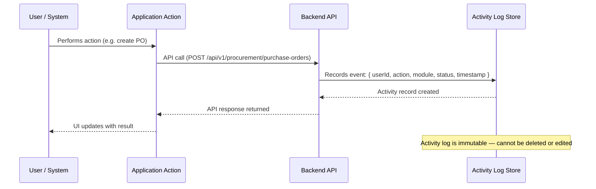

# Activity Log — SIMS Lite

> [!NOTE]
> The Activity Log is accessible at `/admin/activity`. It requires `settings.view` permission (admin or super_admin role). Records are read-only and cannot be modified.

## Overview

The Activity Log provides administrators with a real-time audit stream of all system events — user logins, administrative changes, procurement operations, and security incidents.

---

## Activity Record Structure

| Field | Description |
|-------|-------------|
| `id` | Unique activity record ID |
| `userId` | User who performed the action |
| `userName` | Display name of the user |
| `userEmail` | Email of the user |
| `userRole` | Role at the time of action |
| `action` | Human-readable description of the action |
| `module` | System module (AUTH, USERS, SETTINGS, PROCUREMENT, INVENTORY, EMAIL) |
| `status` | `SUCCESS`, `FAILED`, or `WARNING` |
| `timestamp` | ISO 8601 datetime of event |
| `ipAddress` | Source IP address |
| `details` | JSON payload with additional context |

---

## Supported Modules

| Module Code | Description |
|-------------|-------------|
| `AUTH` | Login / logout / failed authentication |
| `USERS` | User CRUD, role assignment, status changes |
| `SETTINGS` | System settings and company profile changes |
| `EMAIL` | SMTP configuration changes and test events |
| `PROCUREMENT` | PO creation, approval, GRN receipts |
| `INVENTORY` | Stock adjustments, transfers, releases |

---

## Filters & Search

The activity log supports the following filter controls:

| Filter | Type | Description |
|--------|------|-------------|
| Search | Text | Match against action, user name, or email |
| Module | Select | Filter by system module |
| Status | Select | Filter by SUCCESS / FAILED / WARNING |
| Date Range | Date inputs | Filter by timestamp range (API-dependent) |

---

## Audit Logging Workflow



---

## API Endpoint

| Method | Endpoint | Description |
|--------|----------|-------------|
| `GET` | `/api/v1/admin/activity-logs` | Fetch paginated activity log entries |

### Query Parameters

| Parameter | Type | Description |
|-----------|------|-------------|
| `search` | string | Search text |
| `module` | string | Module filter |
| `status` | string | Status filter (SUCCESS/FAILED/WARNING) |
| `startDate` | ISO date | From date |
| `endDate` | ISO date | To date |
| `page` | number | Page number (default: 1) |
| `limit` | number | Items per page (default: 10) |

---

## Query Hook

```typescript
const { data, isLoading } = useActivityLogs({
  search: "login",
  module: "AUTH",
  status: "FAILED",
  page: 1,
  limit: 10,
});
```

---

## Module Location

```
src/features/admin/activity/
├── api/        activity-api.ts
├── components/ ActivityLogFilters, ActivityLogTable, ActivityDetailsModal
├── hooks/      use-activity-log.ts
├── pages/      ActivityLogPage.tsx
└── types/      index.ts
```
