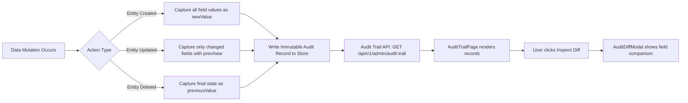

# Audit Trail — SIMS Lite

> [!IMPORTANT]
> Audit trail records are **immutable**. They cannot be edited or deleted through the application. This ensures a tamper-evident history of all data mutations in SIMS Lite.

## Overview

The Audit Trail provides a complete, field-level history of all data entity mutations in the system. Unlike the Activity Log (which captures events), the Audit Trail captures **what changed**, including the previous and new values for every modified field.

Accessible at `/admin/audit`. Requires `settings.view` permission.

---

## Audit Record Structure

| Field | Description |
|-------|-------------|
| `id` | Unique audit record ID |
| `entity` | Entity type (User, Product, PurchaseOrder, Supplier, etc.) |
| `entityId` | Primary key of the affected record |
| `action` | `CREATE`, `UPDATE`, or `DELETE` |
| `userId` | Who performed the change |
| `userName` | Display name |
| `userEmail` | Email |
| `timestamp` | ISO 8601 datetime |
| `ipAddress` | Source IP |
| `changedFields` | Array of field names that were modified |
| `diffs` | Array of `{ field, previousValue, newValue }` objects |

---

## Field Diff Structure

Each record contains a `diffs` array showing precise before/after values:

```json
{
  "diffs": [
    {
      "field": "role",
      "previousValue": "stock_clerk",
      "newValue": "warehouse_manager"
    },
    {
      "field": "department",
      "previousValue": "Logistics",
      "newValue": "Warehouse & Inventory"
    }
  ]
}
```

---

## Audit Logging Workflow



---

## Inspecting Diffs

The `AuditDiffModal` provides a side-by-side visual diff for each changed field:
- **Previous Value** — shown with a red background
- **New Value** — shown with a green background
- Complex object values are formatted as JSON
- `null` or undefined values display as `<Null / Empty>`

---

## Supported Entity Types

| Entity | Audited Actions |
|--------|----------------|
| `User` | CREATE, UPDATE |
| `Product` | CREATE, UPDATE, DELETE |
| `PurchaseOrder` | CREATE, UPDATE |
| `Supplier` | CREATE, UPDATE, DELETE |
| `CompanyProfile` | UPDATE |
| `SystemSettings` | UPDATE |
| `NumberingSequence` | UPDATE |

---

## API Endpoint

| Method | Endpoint | Description |
|--------|----------|-------------|
| `GET` | `/api/v1/admin/audit-trail` | Fetch paginated audit records |

### Query Parameters

| Parameter | Values | Description |
|-----------|--------|-------------|
| `search` | string | Search by entity, entity ID, or user |
| `entity` | `ALL`, `User`, `Product`, `PurchaseOrder`, etc. | Entity type filter |
| `action` | `ALL`, `CREATE`, `UPDATE`, `DELETE` | Action type filter |
| `page` | number | Page number |
| `limit` | number | Items per page |

---

## Query Hook

```typescript
const { data, isLoading } = useAuditTrail({
  entity: "User",
  action: "UPDATE",
  page: 1,
  limit: 10,
});
```

---

## Module Location

```
src/features/admin/audit/
├── api/        audit-api.ts
├── components/ AuditTrailFilters, AuditTrailTable, AuditDiffModal
├── hooks/      use-audit-trail.ts
├── pages/      AuditTrailPage.tsx
└── types/      index.ts
```
