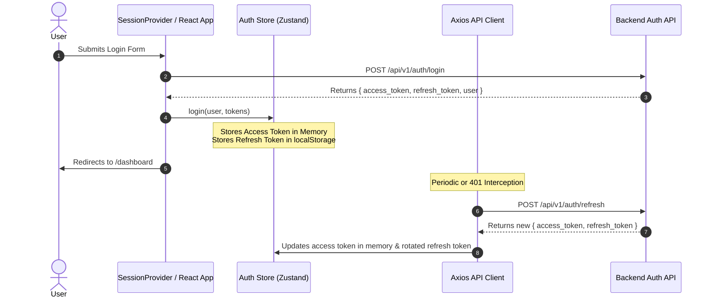
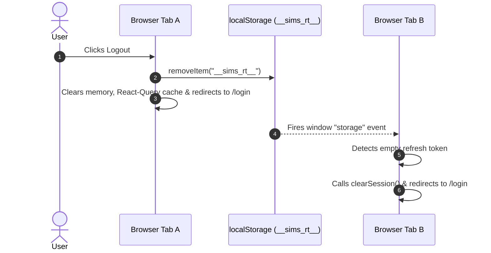

# SIMS Lite Frontend — Authentication & Authorization Security

## 1. Authentication Lifecycle & Token Management

SIMS Lite Frontend implements a dual-token authentication pattern (Short-lived Access Token + Rotation-enabled Refresh Token).

### Token Storage Strategy

* **Access Token**: Kept **exclusively in memory** inside `token.ts`. It is never stored in `localStorage` or standard cookies, protecting it from persistent XSS extraction.
* **Refresh Token**: Kept in `localStorage` under a non-obvious key (`__sims_rt__`). Used only during automatic token rotation and initial app hydration in `SessionProvider`.

---

## 2. Authentication Flow Diagram

---

## 3. Authorization & RBAC Matrix

Permissions follow a domain-action model (`domain.action`). Roles are mapped explicitly in `src/lib/auth/permissions.ts`:

| Permission Domain | `super_admin` / `admin` | `warehouse_manager` | `procurement_officer` | `stock_clerk` | `viewer` |
| :--- | :---: | :---: | :---: | :---: | :---: |
| **Dashboard** (`dashboard.view`) | ✓ | ✓ | ✓ | ✓ | ✓ |
| **User Admin** (`users.*`) | ✓ | ✗ | ✗ | ✗ | ✗ |
| **Products** (`products.*`) | ✓ | ✓ (view) | ✓ (view) | ✓ (view) | ✓ (view) |
| **Purchase Orders** (`purchase_orders.*`) | ✓ | ✓ (view) | ✓ (create/edit) | ✓ (view) | ✗ |
| **GRN** (`grn.*`) | ✓ | ✓ (create/edit) | ✓ (create/edit) | ✓ (create/edit) | ✗ |
| **Inventory Adjustments** (`inventory.adjust`) | ✓ | ✓ | ✗ | ✓ | ✗ |
| **Stock Release Approval** (`stock_release.approve`) | ✓ | ✓ | ✗ | ✗ | ✗ |
| **Reports Export** (`reports.export`) | ✓ | ✗ | ✓ | ✗ | ✗ |
| **System Settings** (`settings.*`) | ✓ | ✗ | ✗ | ✗ | ✗ |

---

## 4. Multi-Tab Session Synchronization Sequence

