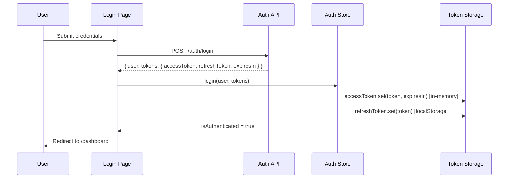
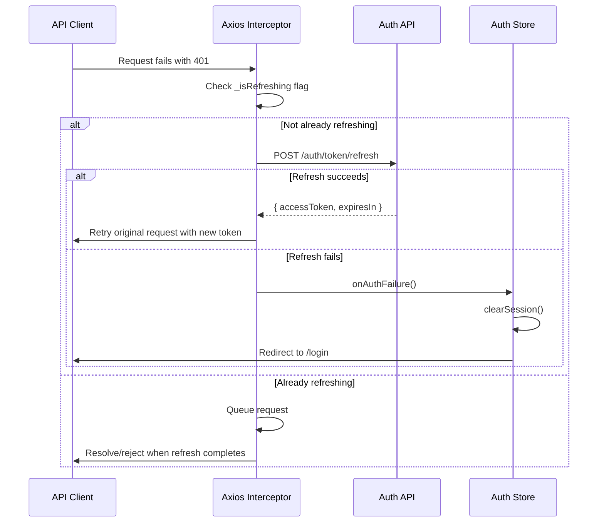

# Authentication

## Overview

SIMS Lite uses JWT-based authentication with an access/refresh token pair. The frontend handles token storage, silent refresh, and session hydration on app load.

## Flow



## Silent Refresh Flow



## Session Hydration

On app load, `SessionProvider` runs before any page renders:

1. Checks for a refresh token in `localStorage`
2. If found, attempts a silent refresh via `POST /auth/token/refresh`
3. On success, restores the in-memory access token and re-populates the auth store
4. On failure, clears all tokens and marks session as unauthenticated
5. Sets `isLoading = false` — the rest of the app renders after this

## Token Storage Strategy

| Token | Storage | Rationale |
|---|---|---|
| Access token | In-memory (`_accessToken` variable) | Not persisted; lost on page refresh, preventing XSS theft from storage |
| Refresh token | `localStorage` | Needed to survive page refresh; used only for the silent refresh call |
| Expiry timestamp | `sessionStorage` | Allows early expiry detection with a 30-second buffer |

## API Endpoints

| Method | Path | Purpose |
|---|---|---|
| `POST` | `/auth/login` | Authenticate and receive tokens |
| `POST` | `/auth/register` | Create account and receive tokens |
| `POST` | `/auth/token/refresh` | Exchange refresh token for new access token |
| `POST` | `/auth/logout` | Invalidate refresh token server-side |
| `POST` | `/auth/forgot-password` | Send password reset email |
| `POST` | `/auth/reset-password` | Reset password with email token |

## Pages

| Route | Component | Guard |
|---|---|---|
| `/login` | `LoginForm` | `GuestRoute` (redirects → `/dashboard` if authenticated) |
| `/register` | `RegisterForm` | `GuestRoute` |
| `/forgot-password` | `ForgotPasswordForm` | `GuestRoute` |
| `/reset-password?token=…` | `ResetPasswordForm` | `GuestRoute` |

## Forms

All forms use **React Hook Form + Zod** with schemas defined in `src/features/auth/schemas.ts`:

- `loginSchema` — email, password, rememberMe
- `registerSchema` — name, email, password, confirmPassword (cross-field match validation)
- `forgotPasswordSchema` — email
- `resetPasswordSchema` — password, confirmPassword (cross-field match validation)

## Auth Store (`src/stores/auth.store.ts`)

```typescript
interface AuthState {
  user: AuthUser | null
  role: UserRole | null
  permissions: Permission[]
  isAuthenticated: boolean
  isLoading: boolean
  login(user, tokens): void
  logout(): Promise<void>
  setUser(user): void
  clearSession(): void
  can(permission): boolean
  hydrateFromStorage(): boolean
}
```

### `can()` shorthand

```typescript
const { can } = useAuthStore();
if (can("products.create")) { /* show create button */ }
```
