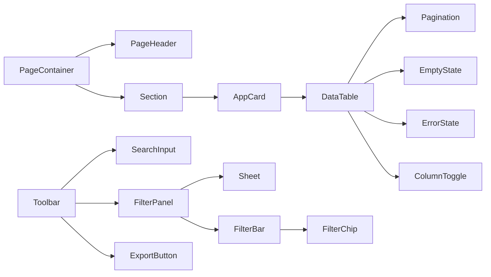

# SIMS Lite — Component Library

## Import Paths

```ts
// shadcn/ui primitives
import { Button, Input, Select } from "@/app/components/ui"

// Common / shared components
import { PageHeader, DataTable, StatusBadge } from "@/components/common"

// Chart wrappers
import { LineChart, KpiCard } from "@/app/components/charts"
```

## Component Catalogue

### Layout Components

#### `PageContainer`
Wraps page content with consistent vertical spacing and optional max-width constraint.

```tsx
<PageContainer maxWidth="xl">
  <PageHeader title="Products" />
  {/* page content */}
</PageContainer>
```

Props: `maxWidth?: "sm" | "md" | "lg" | "xl" | "2xl" | "full"`, `className?`

---

#### `PageHeader`
Consistent header at the top of every page.

```tsx
<PageHeader
  title="Products"
  description="Manage your product catalog"
  breadcrumb={<Breadcrumb items={[...]} />}
  actions={<Button>Add Product</Button>}
/>
```

Props: `title`, `description?`, `actions?`, `breadcrumb?`, `className?`

---

#### `Section`
A labelled content region within a page.

```tsx
<Section title="Billing Information" description="Manage payment method">
  <BillingForm />
</Section>
```

---

#### `Toolbar` / `ToolbarLeft` / `ToolbarRight`
Horizontal control strip above a data table.

```tsx
<Toolbar>
  <ToolbarLeft>
    <SearchInput />
    <FilterPanel>{...}</FilterPanel>
  </ToolbarLeft>
  <ToolbarRight>
    <ExportButton onExport={handleExport} />
    <Button>Add Product</Button>
  </ToolbarRight>
</Toolbar>
```

---

#### `Breadcrumb`
Accessible navigation trail.

```tsx
<Breadcrumb
  items={[
    { label: "Dashboard", href: "/dashboard" },
    { label: "Products", href: "/products" },
    { label: "Edit Product" },
  ]}
  showHomeIcon
/>
```

---

### Cards

#### `AppCard`
Enterprise card with optional header, body, and footer.

```tsx
<AppCard
  title="Recent Orders"
  description="Last 30 days"
  headerActions={<Button size="sm" variant="outline">View All</Button>}
  noPadding  // use for tables
>
  <OrdersTable />
</AppCard>
```

---

#### `StatCard`
KPI metric card for dashboards.

```tsx
<StatCard
  label="Total Products"
  value="1,284"
  icon={<Package className="h-5 w-5" />}
  trend={{ value: 12, label: "vs last month" }}
  loading={isLoading}
/>
```

---

### Status Components

#### `StatusBadge`
Coloured badge for record status.

```tsx
// General statuses
<StatusBadge variant="active" />
<StatusBadge variant="inactive" />
<StatusBadge variant="pending" />
<StatusBadge variant="approved" />
<StatusBadge variant="rejected" />
<StatusBadge variant="draft" />
<StatusBadge variant="cancelled" />

// Inventory
<StatusBadge variant="in-stock" dot />
<StatusBadge variant="low-stock" dot />
<StatusBadge variant="out-of-stock" dot />

// Notifications
<StatusBadge variant="info" />
<StatusBadge variant="success" />
<StatusBadge variant="warning" />
<StatusBadge variant="error" />
```

---

### Feedback / States

#### `EmptyState`
```tsx
<EmptyState
  title="No products found"
  description="Try adjusting your filters."
  action={<Button>Add Product</Button>}
/>
```

#### `LoadingState`
```tsx
<LoadingState text="Fetching inventory…" />
```

#### `ErrorState`
```tsx
<ErrorState error={err} onRetry={refetch} />
```

#### `Spinner` / `InlineLoader`
```tsx
<Spinner size="md" />
<InlineLoader text="Saving changes…" />
```

#### `TableSkeleton` / `CardSkeleton`
```tsx
<TableSkeleton rows={5} columns={6} />
<CardSkeleton />
```

---

### Search & Filter

#### `SearchInput`
Debounced search field with clear button.

```tsx
<SearchInput
  placeholder="Search products…"
  onSearch={(query) => setQuery(query)}
  debounceMs={300}
/>
```

#### `FilterPanel`
Slide-in sheet containing filter controls.

```tsx
<FilterPanel activeCount={activeFilters.length} title="Filter Products">
  <SelectField label="Status" name="status" control={form.control} options={statusOptions} />
  <DateRangePicker value={dateRange} onChange={setDateRange} />
</FilterPanel>
```

#### `FilterBar` / `FilterChip`
Active filter display with remove buttons.

```tsx
<FilterBar
  filters={[
    { label: "Status: Active", onRemove: () => clearFilter("status") },
    { label: "Category: Electronics", onRemove: () => clearFilter("category") },
  ]}
  onClearAll={clearAllFilters}
/>
```

#### `DateRangePicker`
```tsx
<DateRangePicker value={range} onChange={setRange} />
```

---

### Action Components

#### `ExportButton`
```tsx
<ExportButton
  formats={["csv", "xlsx"]}
  onExport={(format) => exportData(format)}
/>
```

#### `CopyButton`
```tsx
<CopyButton value="api-key-here" variant="ghost" size="icon" />
```

---

### Avatar Group

```tsx
<AvatarGroup
  users={[
    { id: "1", name: "Alice Smith", src: "/avatars/alice.jpg" },
    { id: "2", name: "Bob Jones" },
  ]}
  max={4}
  size="md"
/>
```

---

### Permission Guard

```tsx
<PermissionGuard permission="products.create">
  <Button>Add Product</Button>
</PermissionGuard>

<PermissionGuard anyOf={["inventory.adjust", "inventory.transfer"]}>
  <AdjustStockPanel />
</PermissionGuard>
```

---

### File Upload

```tsx
<FileUpload
  accept={{ "image/*": [], "application/pdf": [] }}
  maxFiles={3}
  maxSize={5 * 1024 * 1024}
  imagePreview
  onFilesAccepted={handleUpload}
  files={uploadedFiles}
  onRemove={handleRemove}
/>
```

---

### Sheet (Slide-in Panel)

```tsx
<Sheet>
  <SheetTrigger asChild><Button>Open Panel</Button></SheetTrigger>
  <SheetContent>
    <SheetHeader>
      <SheetTitle>Edit Product</SheetTitle>
    </SheetHeader>
    <ProductForm />
  </SheetContent>
</Sheet>
```

---

## Component Relationships


