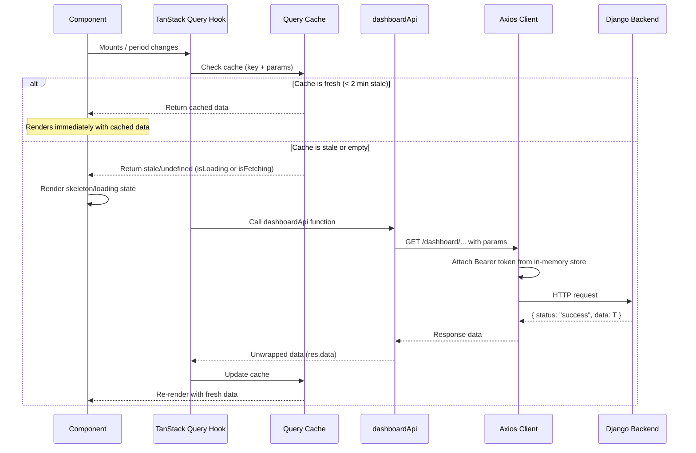
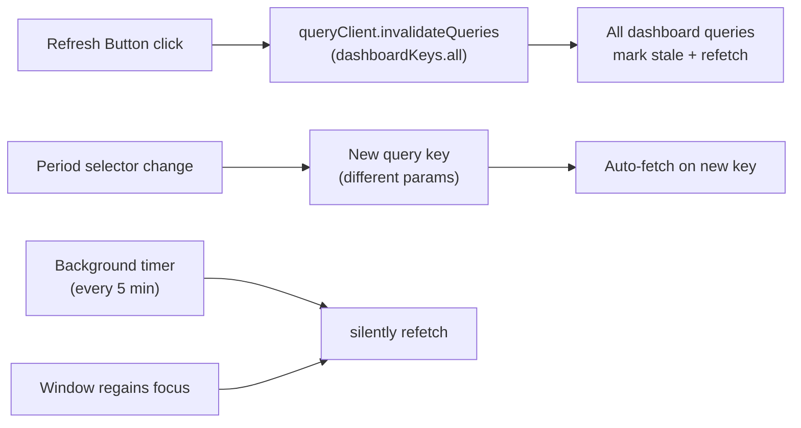
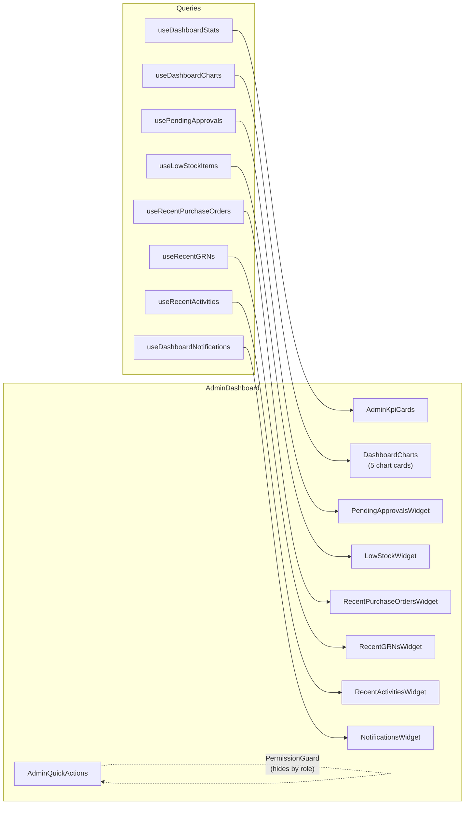
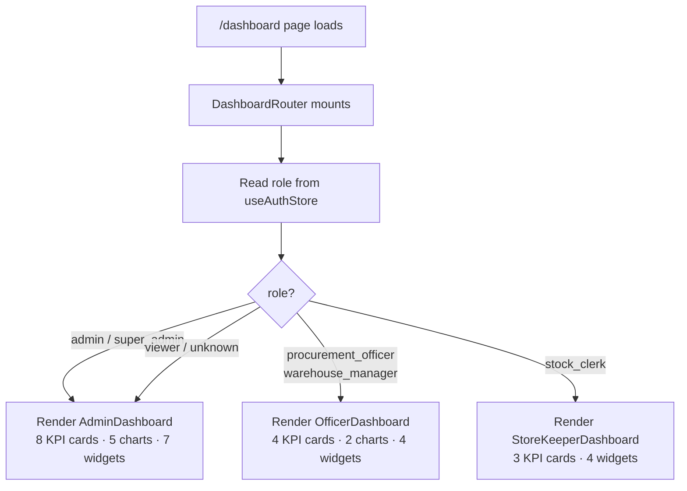

# Dashboard Data Flow

## Architecture Overview

```mermaid
graph TB
    subgraph NextJS["Next.js App Router"]
        Page["DashboardPage\n/app/(dashboard)/dashboard/page.tsx"]
        Router["DashboardRouter\n(role-based switch)"]
        AdminD["AdminDashboard"]
        OfficerD["OfficerDashboard"]
        StoreD["StoreKeeperDashboard"]
    end

    subgraph Hooks["TanStack Query Hooks"]
        useStats["useDashboardStats()"]
        useCharts["useDashboardCharts()"]
        useActivities["useRecentActivities()"]
        useNotifs["useDashboardNotifications()"]
        useApprovals["usePendingApprovals()"]
        usePOs["useRecentPurchaseOrders()"]
        useGRNs["useRecentGRNs()"]
        useLowStock["useLowStockItems()"]
        useAlerts["useInventoryAlerts()"]
        useAdjust["useRecentAdjustments()"]
        useReleases["usePendingStockReleases()"]
    end

    subgraph API["API Layer"]
        dashboardApi["dashboardApi\n(dashboard-api.ts)"]
        axiosClient["Axios Client\n(lib/api/client.ts)"]
    end

    subgraph Auth["Auth Layer"]
        AuthStore["useAuthStore\n(Zustand)"]
        TokenStore["Token Storage\n(in-memory / localStorage)"]
    end

    subgraph Backend["Backend (Django REST)"]
        stats["GET /dashboard/stats"]
        charts["GET /dashboard/charts"]
        activities["GET /dashboard/activities"]
        notifications["GET /dashboard/notifications"]
        approvals["GET /dashboard/pending-approvals"]
        pos["GET /dashboard/recent-purchase-orders"]
        grns["GET /dashboard/recent-grns"]
        lowstock["GET /dashboard/low-stock"]
        alerts["GET /dashboard/inventory-alerts"]
        adjustments["GET /dashboard/recent-adjustments"]
        releases["GET /dashboard/pending-stock-releases"]
    end

    Page --> Router
    Router --> AuthStore
    Router --> AdminD & OfficerD & StoreD

    AdminD --> useStats & useCharts & useActivities & useNotifs & useApprovals & usePOs & useGRNs & useLowStock
    OfficerD --> useStats & useCharts & useNotifs & usePOs & useGRNs
    StoreD --> useStats & useNotifs & useAlerts & useReleases & useAdjust

    useStats --> dashboardApi
    useCharts --> dashboardApi
    useActivities --> dashboardApi
    useNotifs --> dashboardApi
    useApprovals --> dashboardApi
    usePOs --> dashboardApi
    useGRNs --> dashboardApi
    useLowStock --> dashboardApi
    useAlerts --> dashboardApi
    useAdjust --> dashboardApi
    useReleases --> dashboardApi

    dashboardApi --> axiosClient
    axiosClient --> TokenStore
    axiosClient --> stats & charts & activities & notifications & approvals & pos & grns & lowstock & alerts & adjustments & releases
```



## Request Lifecycle



## Cache Invalidation



## Widget Data Flow



## Role Selection Flow



## Query Key Hierarchy

All dashboard query keys are namespaced under `["dashboard"]` for targeted invalidation:

```
["dashboard"]                          ← dashboardKeys.all
["dashboard", "stats", {period}]       ← dashboardKeys.stats(params)
["dashboard", "charts", {period}]      ← dashboardKeys.charts(params)
["dashboard", "activities", limit]     ← dashboardKeys.activities(limit)
["dashboard", "notifications", limit]  ← dashboardKeys.notifications(limit)
["dashboard", "pending-approvals"]     ← dashboardKeys.pendingApprovals()
["dashboard", "recent-purchase-orders", limit]
["dashboard", "recent-grns", limit]
["dashboard", "low-stock", limit]
["dashboard", "inventory-alerts"]
["dashboard", "recent-adjustments", limit]
["dashboard", "pending-stock-releases"]
```

Calling `queryClient.invalidateQueries({ queryKey: ["dashboard"] })` marks every query in this namespace as stale and triggers a background refetch.

## Error Handling

Each widget and chart card independently handles its own error state:
- On error, renders `ErrorState` with the API error message and a "Try Again" button
- The retry button calls the hook's `.refetch()` method
- Other widgets continue loading independently — one failure doesn't block the page
- The axios interceptor handles 401 → token refresh → request retry automatically
