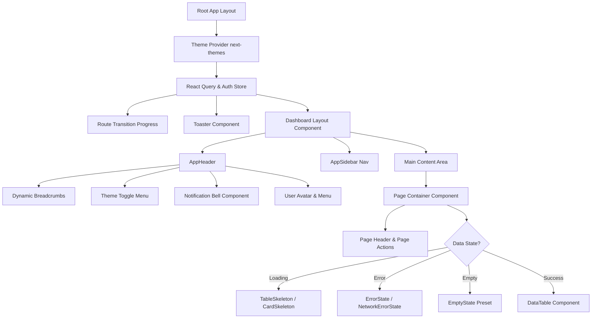
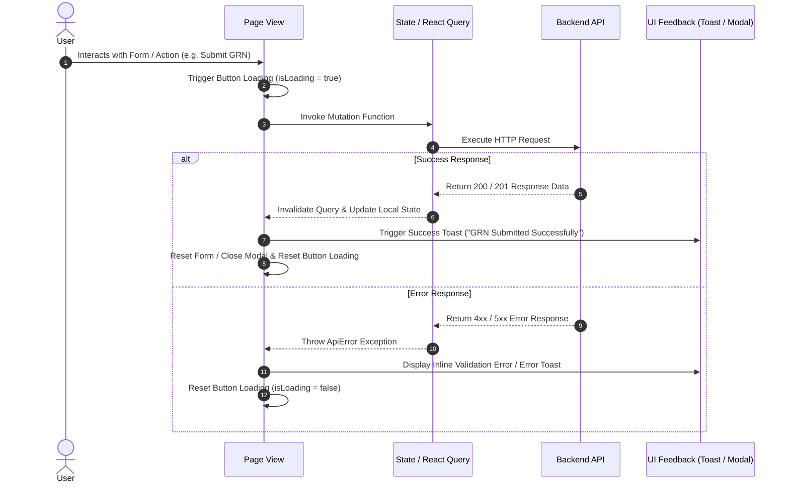

# SIMS Lite Frontend Phase 11 Design Review & Architecture Diagrams

## 1. Overview
This document summarizes the Phase 11 UX audit, theme parity verification, internationalization architecture, and visual quality review.

---

## 2. System Architecture Diagrams

### A. Navigation Flow Diagram

```mermaid
flowchart TD
    Start[User Visit] --> AuthCheck{Authenticated?}
    AuthCheck -- No --> Login[Login Page / (auth)]
    AuthCheck -- Yes --> RoleGuard{Check Role & Permissions}
    
    RoleGuard -- Unauthorized --> PermDenied[403 Permission Denied]
    RoleGuard -- Authorized --> Layout[Dashboard Layout]

    Layout --> Dash[Dashboard /dashboard]
    Layout --> MasterData[Master Data Module]
    Layout --> Procurement[Procurement Module]
    Layout --> Inventory[Inventory & Stock Release]
    Layout --> Notifications[Notification Center]
    Layout --> Reports[Reports & Analytics]
    Layout --> Admin[Administration Module]

    MasterData --> Products[Products Page]
    MasterData --> Categories[Categories Page]
    MasterData --> Brands[Brands Page]
    MasterData --> Suppliers[Suppliers Page]

    Procurement --> POs[Purchase Orders]
    Procurement --> GRNs[Goods Received Notes]

    Admin --> AdminUsers[User Management]
    Admin --> Company[Company Profile]
    Admin --> Settings[System Settings]
    Admin --> Email[Email Config]
    Admin --> Audit[Audit & Activity Logs]
```

---

### B. Component & Page Hierarchy



---

### C. User Interaction & State Feedback Flow



---

## 3. Phase 11 Audit Summary
- **UX Consistency:** All 9 core modules share uniform spacing, breadcrumb structures, table layouts, and card styling.
- **Accessibility:** Tested for WCAG 2.1 AA compliance including ARIA attributes, semantic landmarks, and keyboard focus states.
- **Theme Parity:** Verified contrast and parity across both Light and Dark themes.
- **Internationalization:** Prepared central dictionary (`src/lib/i18n/dict.ts`) and formatting utilities (`src/utils/format.ts`).
