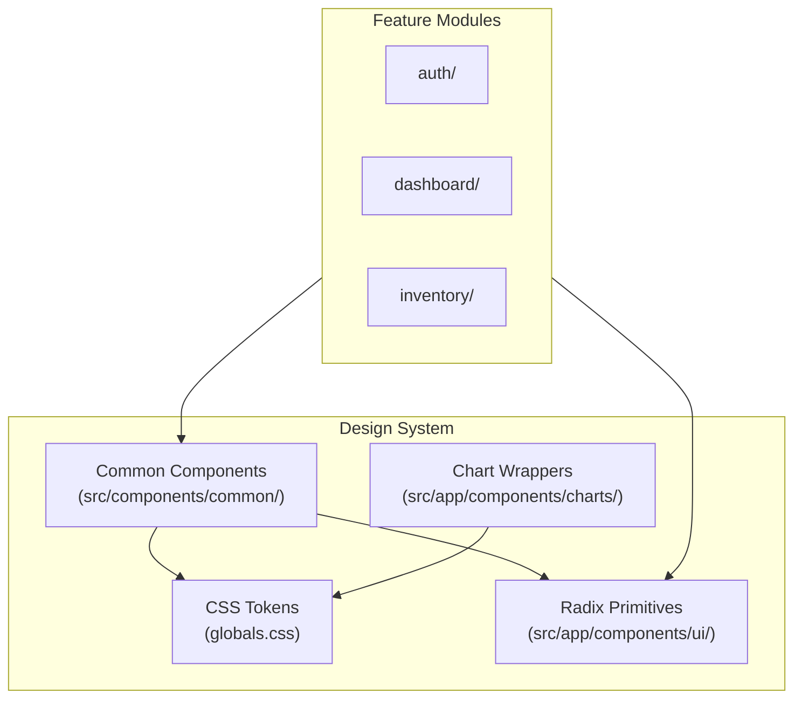

# SIMS Lite — Design System

## Overview

The SIMS Lite design system provides a consistent visual language across all feature modules. It is built on:

| Layer | Technology |
|---|---|
| Design tokens | CSS custom properties (Tailwind v4 `@theme`) |
| UI primitives | Radix UI + shadcn/ui |
| Utility | clsx + tailwind-merge |
| Icons | lucide-react |

## Architecture



## Design Tokens

All tokens are defined as CSS custom properties in `src/app/globals.css` via `@theme`.

### Colour Palette

| Token | Light | Dark | Purpose |
|---|---|---|---|
| `--color-background` | `hsl(0 0% 100%)` | `hsl(222 47% 7%)` | Page background |
| `--color-foreground` | `hsl(222 47% 11%)` | `hsl(210 40% 98%)` | Body text |
| `--color-primary` | `hsl(221 83% 53%)` | same | Brand blue |
| `--color-muted` | `hsl(210 40% 96%)` | `hsl(217 33% 17%)` | Subtle fills |
| `--color-destructive` | `hsl(0 84% 60%)` | `hsl(0 62% 50%)` | Error / delete |
| `--color-border` | `hsl(214 32% 91%)` | `hsl(217 33% 20%)` | Lines |
| `--color-card` | `hsl(0 0% 98%)` | `hsl(222 47% 10%)` | Card background |

### Chart Colours

Five CSS variables (`--color-chart-1` through `--color-chart-5`) provide accessible, theme-aware chart colours.

### Sidebar Colours

Dedicated sidebar tokens (`--color-sidebar-*`) decouple the sidebar from the main canvas.

## Typography

| Element | Size | Weight |
|---|---|---|
| `h1` | 1.875rem | 600 |
| `h2` | 1.5rem | 600 |
| `h3` | 1.25rem | 600 |
| Body | 1rem | 400 |
| Small | 0.875rem | 400 |
| XS | 0.75rem | 400 |

Font: **Inter** via `next/font/google`.

## Spacing Scale

Uses Tailwind's default scale. Key page-level spacing:

- Page container gap: `gap-6` (1.5rem)
- Card padding: `p-6` (1.5rem)
- Section gap: `gap-4` (1rem)

## Responsive Breakpoints

| Breakpoint | Width |
|---|---|
| `sm` | 640px |
| `md` | 768px |
| `lg` | 1024px |
| `xl` | 1280px |
| `2xl` | 1536px |

## Theme System

- `next-themes` manages light / dark / system preference.
- All component colours use semantic tokens, never raw hex values.
- Dark mode is applied via the `.dark` class on `<html>`.

## Using Design Tokens in Components

```tsx
// ✅ Correct — semantic tokens
<div className="bg-card border border-border text-foreground" />

// ❌ Avoid — raw colours
<div className="bg-white border-gray-200 text-gray-900" />
```
