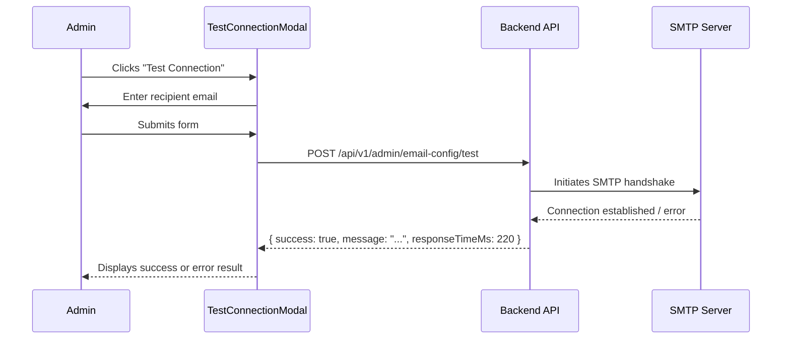

# Email Configuration — SIMS Lite

> [!NOTE]
> Email Configuration is accessible at `/admin/email`. It requires `settings.edit` permission (admin or super_admin only).

## Overview

The Email Configuration page allows administrators to configure the SMTP gateway used by SIMS Lite for all automated notifications, PO alerts, password resets, and report deliveries.

---

## Configurable Fields

| Field | Required | Description |
|-------|----------|-------------|
| SMTP Host | ✅ | Outgoing mail server hostname |
| SMTP Port | ✅ | Usually 25, 465 (SSL), or 587 (TLS/STARTTLS) |
| SMTP Username | ✅ | Authentication username |
| SMTP Password | ❌ | Masked unless re-entered. Leave blank to keep existing. |
| Encryption Type | ✅ | `NONE`, `TLS` (STARTTLS), or `SSL` |
| Sender Name | ✅ | "From" display name in emails |
| Sender Email | ✅ | "From" email address |

### Port Guidelines

| Port | Protocol |
|------|----------|
| 25 | SMTP (unencrypted, may be blocked) |
| 465 | SMTPS (implicit SSL) |
| 587 | SMTP + STARTTLS (recommended) |

---

## Password Security

The SMTP password is **never returned** in API responses. The `isPasswordSet` flag indicates whether a password has been stored. If left blank during save, the existing password is preserved. To update the password, enter a new value.

---

## Testing the Connection

The **Test Connection** button opens `TestConnectionModal` where the administrator enters a recipient email address. On submission:

1. A live SMTP connection attempt is made server-side
2. A test email is sent to the specified recipient
3. The result (`success`, `message`, `responseTimeMs`) is displayed inline in the modal



---

## API Endpoints

| Method | Endpoint | Description |
|--------|----------|-------------|
| `GET` | `/api/v1/admin/email-config` | Fetch current email configuration |
| `PUT` | `/api/v1/admin/email-config` | Save updated email configuration |
| `POST` | `/api/v1/admin/email-config/test` | Test SMTP connection with recipient email |

---

## Query Hooks

```typescript
const { data: emailConfig } = useEmailConfig();
const { mutate: updateConfig } = useUpdateEmailConfig();
const { mutate: testConnection, data: testResult, isPending } = useTestEmailConnection();
```

---

## Module Location

```
src/features/admin/email/
├── api/        email-api.ts
├── components/ EmailConfigForm.tsx, TestConnectionModal.tsx
├── hooks/      use-email-config.ts
├── pages/      EmailConfigPage.tsx
├── schemas/    email.schema.ts
└── types/      index.ts
```
