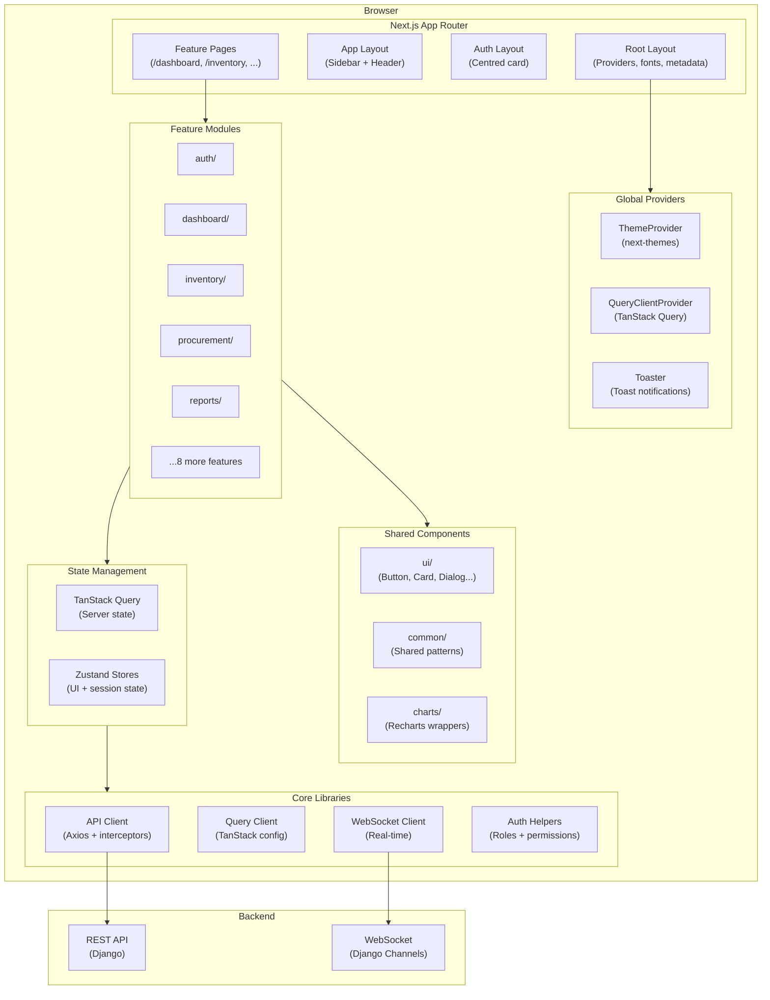

# SIMS Lite — Frontend Architecture

## Overview

SIMS Lite is an enterprise inventory management system built as a Next.js application
with a feature-based architecture optimised for scalability, maintainability, and
developer experience.

## Technology Stack

| Layer | Technology | Rationale |
|---|---|---|
| Framework | Next.js 16 (App Router) | RSC, file-based routing, built-in optimisations |
| Language | TypeScript (strict) | Type safety across the entire codebase |
| Styling | Tailwind CSS v4 | Utility-first, zero dead CSS in production |
| UI Components | shadcn/ui + Radix UI | Accessible, unstyled primitives with full control |
| Server State | TanStack Query v5 | Caching, background sync, optimistic updates |
| Client State | Zustand v5 | Minimal, scalable global state |
| Forms | React Hook Form + Zod | Performant forms with schema validation |
| HTTP | Axios | Interceptors, token management, error normalisation |
| Theme | next-themes | SSR-safe dark/light/system theme switching |
| Dates | date-fns | Tree-shakeable date utilities |

## Architecture Diagram



## Feature Module Structure

Each feature follows a consistent internal structure:

```
src/features/<feature>/
├── index.ts          # Public API (barrel export)
├── components/       # Feature-scoped components
├── hooks/            # Feature-specific hooks (useQuery, useMutation wrappers)
├── schemas.ts        # Zod validation schemas
├── types.ts          # Feature TypeScript types
└── api.ts            # API call functions (used by hooks)
```

## Data Flow

```
User Interaction
    ↓
React Component (feature)
    ↓
TanStack Query hook / Zustand action
    ↓
Axios API Client (with JWT interceptor)
    ↓
REST API / WebSocket
    ↓
Response normalisation
    ↓
Query cache update / Store update
    ↓
React re-render
```

## Role-Based Access

Roles (lowest → highest privilege):

```
viewer < stock_clerk < procurement_officer < warehouse_manager < admin < super_admin
```

The `hasPermission(userRole, requiredRole)` helper in `src/lib/auth/index.ts` provides
simple role comparison. Route-level guards will be implemented in Phase 1 (Auth).

## Theme System

- CSS custom properties map to Tailwind tokens (light and dark variants)
- `next-themes` handles SSR-safe system preference detection
- Components use semantic tokens (`bg-background`, `text-foreground`, `border-border`)
  rather than raw colours to ensure both themes work automatically
- No hardcoded colour values in component files
