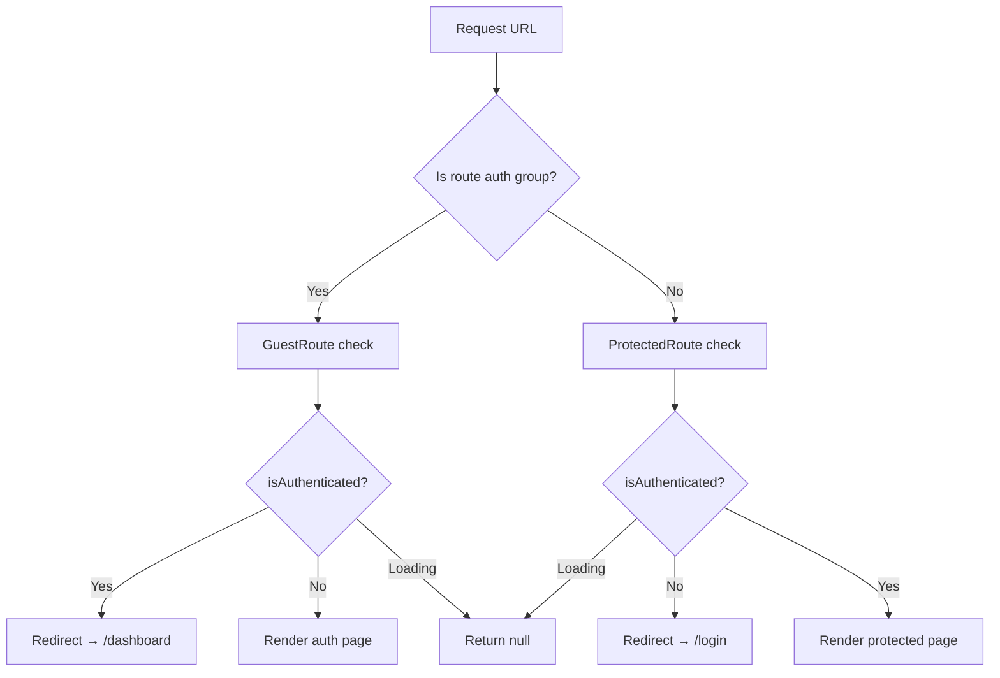

# Frontend Routing

## Route Structure

SIMS Lite uses Next.js App Router with route groups for layout isolation:

```
src/app/
├── (auth)/           # Auth layout — centered card, no sidebar
│   ├── layout.tsx
│   ├── login/page.tsx
│   ├── register/page.tsx
│   ├── forgot-password/page.tsx
│   └── reset-password/page.tsx
├── (dashboard)/      # Dashboard layout — sidebar + header
│   ├── layout.tsx
│   └── dashboard/page.tsx
├── layout.tsx        # Root layout — providers, fonts
├── page.tsx          # Redirects → /dashboard
├── error.tsx         # Global error boundary
└── not-found.tsx     # 404 page
```

## Route Protection Flow



## Guard Components

### `ProtectedRoute`

Wraps all authenticated pages. Redirects to `/login` if the user is not authenticated.

```tsx
// Applied automatically via (dashboard)/layout.tsx → DashboardLayout
<ProtectedRoute>
  {children}
</ProtectedRoute>
```

### `GuestRoute`

Wraps all auth pages. Redirects to `/dashboard` if the user is already authenticated.

```tsx
// Applied in each (auth) page
<GuestRoute>
  <LoginForm />
</GuestRoute>
```

### `PermissionGuard`

Conditionally renders UI based on role permissions. Does not redirect — it hides/shows content.

```tsx
// Single permission
<PermissionGuard permission="products.create">
  <CreateButton />
</PermissionGuard>

// Any of multiple permissions
<PermissionGuard anyOf={["inventory.adjust", "inventory.transfer"]}>
  <AdjustPanel />
</PermissionGuard>

// All permissions required
<PermissionGuard allOf={["reports.view", "reports.export"]}>
  <ExportButton />
</PermissionGuard>

// With fallback
<PermissionGuard permission="settings.edit" fallback={<ReadOnlyView />}>
  <EditableView />
</PermissionGuard>
```

## Adding New Authenticated Routes

1. Create the page inside `src/app/(dashboard)/`
2. The `DashboardLayout` (sidebar + header + `ProtectedRoute`) is applied automatically
3. Add a nav item in `AppSidebar.tsx` with the required permissions

## Adding New Auth Routes

1. Create the page inside `src/app/(auth)/`
2. Wrap content in `<GuestRoute>`
3. The auth layout (centered card + branding) is applied automatically
