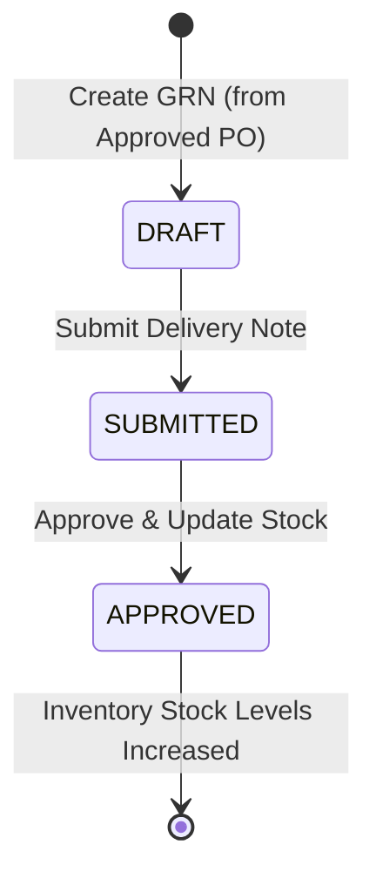

# Goods Received Notes (GRNs) Module Documentation

## Overview
The Goods Received Notes (GRN) module tracks physical goods delivered by suppliers against approved Purchase Orders.

## Features
- **Strict Approval Dependency**: GRNs can only be initiated from an **APPROVED** Purchase Order.
- **Full & Partial Delivery Handling**: Storekeepers can receive full quantities or log partial deliveries with discrepancy notes.
- **Inventory Impact Summary**: Upon final approval of a GRN, stock levels for all received items are automatically increased in the inventory catalog.
- **Role Permissions**:
  - **STORE_KEEPER / Stock Clerk**: Create, edit, and submit GRNs.
  - **ADMIN / Procurement Officer**: Approve GRNs to commit inventory updates.

## GRN Lifecycle

