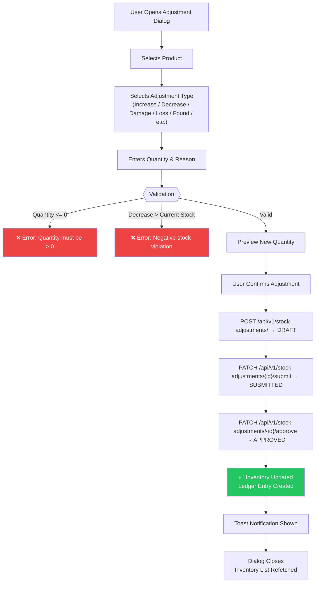

# Inventory Adjustments Documentation

## Overview

Stock Adjustments allow authorized users to manually correct inventory levels when discrepancies arise between physical and system stock. Adjustments are submitted through the `StockAdjustmentDialog` and processed via a multi-step API workflow.

## Stock Adjustment Workflow



## Adjustment Types

| Type | Direction | Description |
|---|:---:|---|
| `increase` | ➕ | General stock increase |
| `decrease` | ➖ | General stock decrease |
| `damage` | ➖ | Damaged goods write-down |
| `loss` | ➖ | Loss or theft |
| `found` | ➕ | Found previously lost items |
| `cycle_count` | ➕ | Cycle count correction (adds to stock) |
| `write_off` | ➖ | Full write-off of stock items |

## Component: `StockAdjustmentDialog`

**File**: [StockAdjustmentDialog.tsx](file:///d:/My%20Projects/SIMS-Lite-Frontend/src/features/inventory/components/adjustment-dialog/StockAdjustmentDialog.tsx)

### Props

```typescript
interface StockAdjustmentDialogProps {
  open: boolean;                   // Dialog visibility
  onOpenChange: (open: boolean) => void;
  inventoryItem: InventoryItem | null;  // The item to adjust
  onSuccess?: () => void;          // Callback after successful adjustment
}
```

### Validation Rules

All validation is handled via the `stockAdjustmentSchema` Zod schema:

1. `adjustment_type` — must be a valid enum value
2. `quantity_adjusted` — must be `> 0`
3. `reason` — required, min 1 char, max 500 chars
4. **Negative stock guard** — if adjustment type is a deduction (`decrease`, `damage`, `loss`, `write_off`) and `quantity_adjusted > current_quantity`, a client-side error is raised before any API call

### Real-Time Preview

As the user types a quantity, the component dynamically computes and displays the **New Stock Preview**:

```typescript
function calculateNewQuantity(
  currentQty: number,
  adjustmentType: StockAdjustmentType,
  adjustedQty: number
): number
```

The preview quantity is colour-coded:
- 🟢 Green — positive and healthy stock
- 🟡 Amber — zero stock after adjustment
- 🔴 Red — negative (blocked by validation)

## Permissions

Only the following roles can perform stock adjustments:

| Role | Can Adjust |
|---|:---:|
| `admin` | ✅ |
| `super_admin` | ✅ |
| `store_keeper` | ✅ |
| `warehouse_manager` | ✅ |
| `officer` | ❌ |

The Adjust button is hidden entirely for unauthorized roles (no disabled state — fully removed from DOM).

## API Flow

```typescript
// Step 1: Create draft adjustment
POST /api/v1/stock-adjustments/
{
  "adjustment_type": "decrease",
  "reason": "Physical count discrepancy",
  "notes": "Cycle count 2026-07-27",
  "items": [
    {
      "product_id": "uuid",
      "quantity_adjusted": 5,
      "unit_cost": 10.0
    }
  ]
}
// → returns { status: "DRAFT", id: "adj-uuid" }

// Step 2: Submit
PATCH /api/v1/stock-adjustments/{adj-uuid}/submit
// → returns { status: "SUBMITTED" }

// Step 3: Approve (immediately posts to inventory ledger)
PATCH /api/v1/stock-adjustments/{adj-uuid}/approve
// → returns { status: "APPROVED" }
```

> [!NOTE]
> The frontend currently performs all three steps atomically on submit for a streamlined UX. The backend fully supports a multi-step approval workflow if required in the future.

## Query Invalidation

After a successful adjustment, the following query caches are invalidated:

- `["inventory"]` — all inventory list/detail/summary queries
- `["dashboard"]` — dashboard KPI widgets
