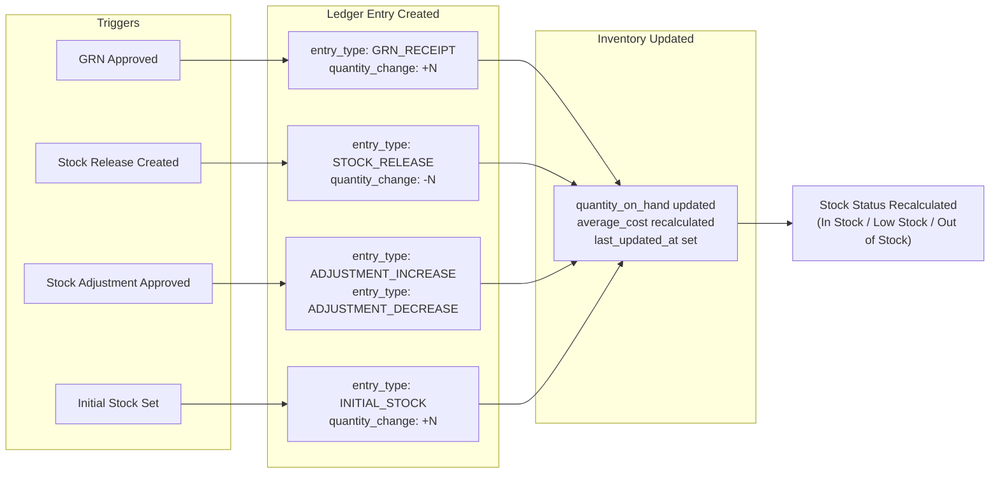

# Inventory History (Ledger) Documentation

## Overview

The Inventory History module provides a complete, immutable audit trail of every stock movement. Each transaction — whether a GRN receipt, stock release, or manual adjustment — creates a permanent ledger entry. This ensures full traceability and accountability for all inventory changes.

## Inventory Movement Flow



## Ledger Entry Structure

Each ledger entry captures a full snapshot of the inventory state at the time of the transaction:

| Field | Description |
|---|---|
| `id` | Unique identifier for this ledger entry |
| `product` | Reference to the product (name, SKU, barcode, reorder level) |
| `entry_type` | The type of movement (see table below) |
| `quantity_before` | Stock level before this transaction |
| `quantity_change` | Delta applied (positive = increase, negative = decrease) |
| `quantity_after` | Stock level after this transaction |
| `unit_cost` | Unit cost at time of transaction |
| `reference_type` | Document type that caused this entry (GRN, STOCK_RELEASE, etc.) |
| `reference_id` | ID of the originating document |
| `reference_number` | Human-readable document number |
| `notes` | Optional notes or reason |
| `created_by` | User who triggered the transaction |
| `created_at` | Exact timestamp of the movement |

## Supported Entry Types

| Entry Type | Label | Direction | Source |
|---|---|:---:|---|
| `GRN_RECEIPT` | GRN Receipt | ➕ | Goods Received Note approved |
| `STOCK_RELEASE` | Stock Release | ➖ | Stock Release document created |
| `ADJUSTMENT_INCREASE` | Adjustment (+) | ➕ | Stock adjustment (increase types) |
| `ADJUSTMENT_DECREASE` | Adjustment (-) | ➖ | Stock adjustment (decrease types) |
| `INITIAL_STOCK` | Initial Stock | ➕ | Initial stock setup |
| `RETURN` | Customer Return | ➕ | Customer return processed |
| `TRANSFER` | Stock Transfer | ↔️ | Inter-location transfer |

## Pages

### Full History Page — `/inventory/history`

**Component**: [InventoryHistoryPage](file:///d:/My%20Projects/SIMS-Lite-Frontend/src/features/inventory/pages/InventoryHistoryPage.tsx)

Filters available:
- **Date Range** — from/to date pickers
- **Entry Type** — filter by movement type
- **Search** — reference numbers or notes
- **Product ID** — pre-filter by product (used when navigating from detail page)

### Detail Page History Preview — `/inventory/:productId`

**Component**: [InventoryDetailPage](file:///d:/My%20Projects/SIMS-Lite-Frontend/src/features/inventory/pages/InventoryDetailPage.tsx)

Displays the 10 most recent ledger entries for the product. Includes a link to view the full history for that product.

## API Endpoints

### GET `/api/v1/inventory-ledger/`

Returns paginated ledger entries across all products.

**Query parameters:**

| Parameter | Type | Description |
|---|---|---|
| `page` | integer | Page number (1-indexed) |
| `size` | integer | Records per page (max 200) |
| `product_id` | UUID | Filter by product |
| `entry_type` | string | Filter by entry type |
| `reference_type` | string | Filter by document source |
| `from_date` | datetime | Start of date range (ISO 8601) |
| `to_date` | datetime | End of date range (ISO 8601) |

### GET `/api/v1/inventory-ledger/product/{product_id}`

Returns paginated ledger entries for a specific product.

## TanStack Query Integration

### `useInventoryLedger(params?)`

```typescript
const { data, isLoading, error, refetch } = useInventoryLedger({
  page: 1,
  size: 20,
  entry_type: "GRN_RECEIPT",
  from_date: "2026-07-01T00:00:00Z",
  to_date: "2026-07-31T23:59:59Z",
});
```

### `useProductLedger(productId, page, size)`

```typescript
const { data, isLoading } = useProductLedger("product-uuid", 1, 10);
```

Both hooks use stale-time of 30 seconds. Ledger data is invalidated automatically when stock adjustments are approved.

## Immutability

> [!IMPORTANT]
> Inventory ledger entries are **immutable**. Once written, they cannot be edited or deleted. This ensures a tamper-proof audit trail. Corrections are made via new opposing adjustment entries.

## Reference Links

The `InventoryHistoryTable` auto-resolves reference documents and renders clickable links:

| `reference_type` | Links To |
|---|---|
| `GRN` / `goods_received_note` | `/procurement/grn/:reference_id` |
| `PURCHASE_ORDER` / `purchase_order` | `/procurement/purchase-orders/:reference_id` |
| `STOCK_RELEASE` / `stock_release` | `/stock-release/:reference_id` |
| `null` / other | Displays as "Manual Adjustment" |
