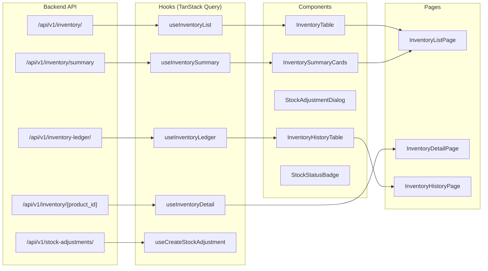
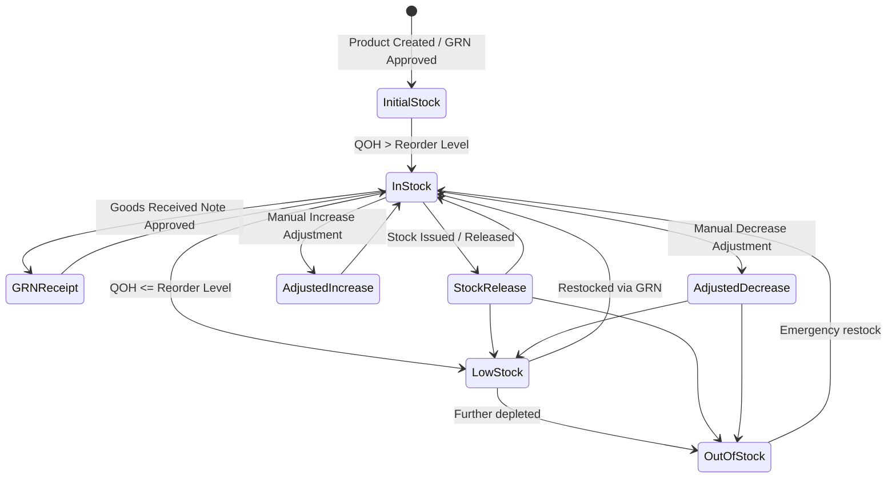

# Inventory Module Documentation

## Overview

The Inventory Management module provides complete store-wide real-time visibility into inventory stock levels, valuations, and movements. It is the central module in SIMS Lite for tracking what products are available in the warehouse, detecting low or out-of-stock conditions, and performing stock adjustments.

## Architecture



## Inventory Lifecycle



## Module Structure

```
src/features/inventory/
├── api/
│   └── inventory-api.ts         # Axios API client for all inventory endpoints
├── components/
│   ├── inventory-table/
│   │   └── InventoryTable.tsx   # Enterprise DataTable with sorting + pagination
│   ├── inventory-summary/
│   │   └── InventorySummaryCards.tsx  # KPI stat cards
│   ├── adjustment-dialog/
│   │   └── StockAdjustmentDialog.tsx # Modal for stock adjustments
│   ├── stock-status/
│   │   └── StockStatusBadge.tsx  # Reusable status indicator badge
│   ├── inventory-history/
│   │   └── InventoryHistoryTable.tsx # Audit ledger table
│   └── filters/
│       ├── InventoryFilters.tsx # Top filter bar for overview page
│       └── LedgerFilters.tsx    # Filter bar for history page
├── hooks/
│   └── use-inventory.ts         # TanStack Query hooks
├── pages/
│   ├── InventoryListPage.tsx    # Main overview page
│   ├── InventoryDetailPage.tsx  # Per-product detail page
│   └── InventoryHistoryPage.tsx # Full movement ledger
├── schemas/
│   └── index.ts                 # Zod validation schemas
├── types/
│   └── index.ts                 # TypeScript interfaces
└── utils/
    └── inventory-utils.ts       # Utility helpers
```

## Routes

| Route | Component | Description |
|---|---|---|
| `/inventory` | `InventoryListPage` | Store-wide inventory overview |
| `/inventory/:productId` | `InventoryDetailPage` | Per-product inventory detail |
| `/inventory/history` | `InventoryHistoryPage` | Full movement ledger/audit trail |

## Stock Status Logic

Stock status is determined by comparing `quantity_on_hand` with the product's `reorder_level`:

| Status | Condition |
|---|---|
| `out_of_stock` | `quantity_on_hand <= 0` |
| `low_stock` | `0 < quantity_on_hand <= reorder_level` |
| `in_stock` | `quantity_on_hand > reorder_level` |

## API Endpoints

### GET `/api/v1/inventory/`
Returns paginated current stock list.

**Query parameters:**
- `page`, `size` — Pagination
- `search` — Search by product name, SKU, or barcode
- `category_id` — Filter by product category
- `supplier_id` — Filter by supplier
- `low_stock_only` — Show only low stock items
- `out_of_stock_only` — Show only out of stock items

### GET `/api/v1/inventory/summary`
Returns aggregate inventory summary KPIs.

### GET `/api/v1/inventory/{product_id}`
Returns current stock for a single product.

### GET `/api/v1/inventory-ledger/`
Returns paginated inventory movement ledger.

### GET `/api/v1/inventory-ledger/product/{product_id}`
Returns movements for a specific product.

## Role-Based Access

| Permission | Admin | Officer | Store Keeper |
|---|:---:|:---:|:---:|
| View inventory | ✅ | ✅ | ✅ |
| Perform adjustments | ✅ | ❌ | ✅ |

The `Adjust` button and `StockAdjustmentDialog` are only shown to users with roles: `admin`, `super_admin`, `store_keeper`, `warehouse_manager`.

## Query Keys

All inventory query keys are organized under the `inventoryKeys` factory:

```typescript
inventoryKeys.all              // ["inventory"]
inventoryKeys.lists()          // ["inventory", "list"]
inventoryKeys.list(params)     // ["inventory", "list", { ...params }]
inventoryKeys.summary()        // ["inventory", "summary"]
inventoryKeys.detail(id)       // ["inventory", "detail", id]
inventoryKeys.ledger(params)   // ["inventory", "ledger", { ...params }]
```

Successful stock adjustments invalidate all inventory queries and dashboard queries automatically.
