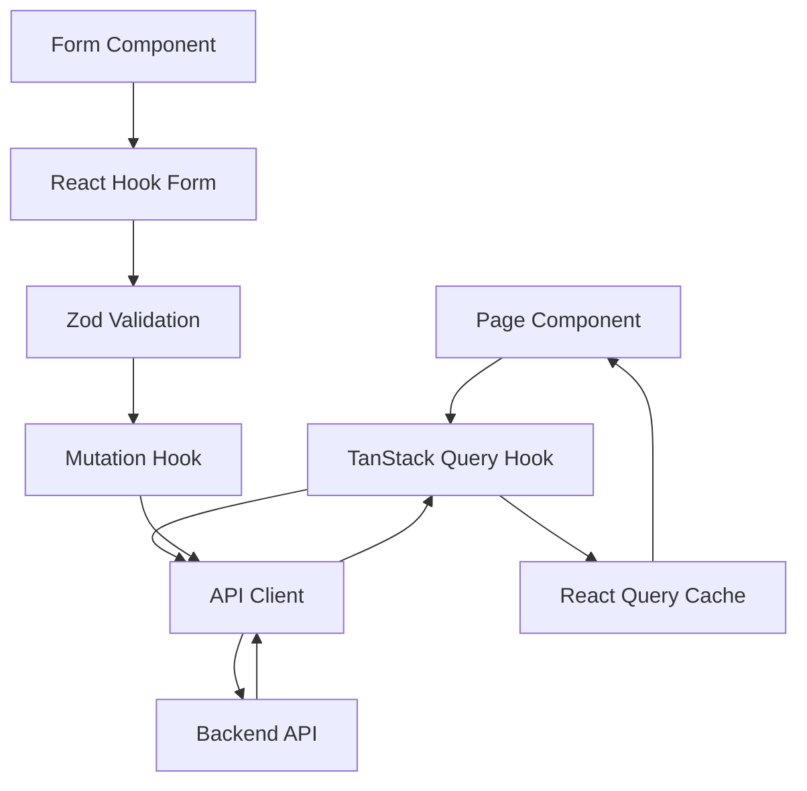
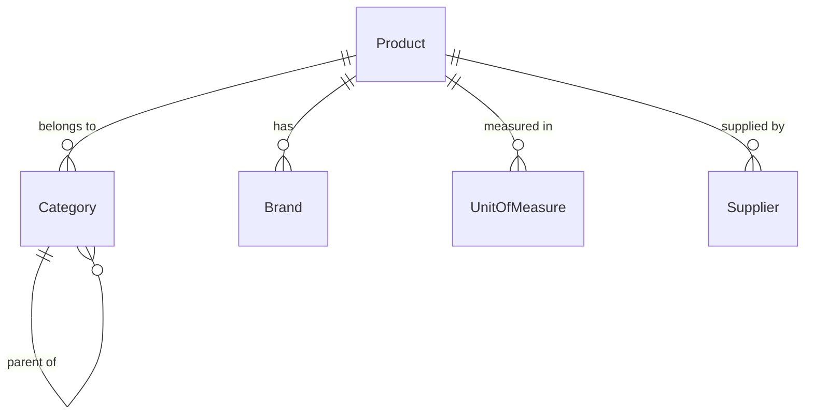

# Master Data Management

## Overview

The Master Data Management module provides CRUD interfaces for all core reference data used across the SIMS Lite system. This includes products, categories, brands, units of measure (UoMs), and suppliers.

## Architecture

All master data modules follow a consistent structure:

```
src/features/master-data/
├── products/
│   ├── components/       # Product-specific UI components
│   ├── pages/            # Product pages (list, detail)
│   └── ...
├── categories/
├── brands/
├── uoms/
├── suppliers/
├── api/                  # API client methods for all modules
├── hooks/                # TanStack Query hooks for all modules
├── schemas/              # Zod validation schemas
├── types/                # TypeScript types
└── utils/                # Shared utilities
```

## Components

### Common Pattern

Each entity follows this structure:

1. **List Page** — DataTable with search, filters, sorting, pagination
2. **Detail Page** — Full entity view with related data
3. **Form** — Reusable create/edit form
4. **Form Dialog** — Modal wrapper for the form
5. **API Client** — Typed API methods
6. **TanStack Query Hooks** — Data fetching, mutations, cache invalidation
7. **Validation Schema** — Zod schema for form validation

## Data Flow



## Entity Relationships



## Permissions

All master data operations are protected by RBAC:

| Role              | Products | Categories | Brands | UoMs | Suppliers |
|-------------------|----------|------------|--------|------|-----------|
| **ADMIN**         | Full     | Full       | Full   | Full | Full      |
| **OFFICER**       | View     | —          | —      | —    | Full      |
| **STORE_KEEPER**  | View     | —          | —      | —    | —         |
| **VIEWER**        | —        | —          | —      | —    | —         |

Permissions are enforced at:
- **Route level** — via ProtectedRoute wrapper
- **UI level** — via PermissionGuard components
- **API level** — backend validates all requests

## Features

### Search & Filtering

All list pages support:
- **Text search** — searches name, SKU (products), company name (suppliers)
- **Status filtering** — active/inactive toggle
- **Entity-specific filters**:
  - Products: category, brand, supplier
  - Categories: parent category

### Sorting & Pagination

- **Server-side sorting** — click column headers (Products only)
- **Server-side pagination** — configurable page size (10, 20, 50, 100)
- **Total count** — displayed in pagination controls

### Soft Delete

All entities support soft delete:
- Deleted records are marked `is_active: false`
- Hidden by default (toggle "Show Inactive")
- Can be restored via restore action

## Usage Examples

### Creating a Product

```typescript
import { useCreateProduct } from "@/features/master-data/hooks/use-products";

function MyComponent() {
  const createProduct = useCreateProduct();

  async function handleCreate() {
    await createProduct.mutateAsync({
      name: "USB Cable",
      sku: "USB-001",
      category_id: "cat-id",
      min_stock_level: 10,
      is_active: true,
    });
  }
}
```

### Filtering Products by Category

```typescript
import { useProducts } from "@/features/master-data/hooks/use-products";

function ProductList() {
  const { data, isLoading } = useProducts({
    page: 1,
    page_size: 20,
    category_id: "electronics-id",
    is_active: true,
  });

  return <DataTable columns={columns} data={data?.data ?? []} />;
}
```

## Integration Points

### Dashboard

Master data metrics are displayed on the role-specific dashboard:
- Total products
- Active suppliers
- Low stock alerts

### Inventory

Products link to:
- Stock movements
- Stock levels
- Reorder points

### Procurement

Products and Suppliers link to:
- Purchase orders
- GRN (Goods Received Notes)

## Best Practices

1. **Always validate forms** — use Zod schemas
2. **Handle API errors** — display user-friendly messages
3. **Optimistic updates** — for better UX (already implemented in hooks)
4. **Cache invalidation** — hooks automatically invalidate related queries
5. **Accessibility** — all components have proper ARIA labels
6. **Responsive** — mobile-friendly tables (horizontal scroll fallback)

## Testing

See `docs/testing.md` for test strategy.

## Future Enhancements

- [ ] Bulk import (CSV/Excel)
- [ ] Bulk edit
- [ ] Export to CSV/PDF
- [ ] Product images
- [ ] Product variants
- [ ] Supplier contact history
- [ ] Advanced filtering panel
