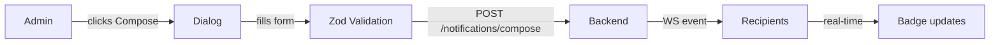

# Notification Center

The Notification Center (`/notifications`) is the dedicated full-page view for managing all notifications.

---

## Accessing the Page

The page is available from:
- **Sidebar** → Notifications link (visible to all authenticated users)
- **NotificationBell** → "View all notifications" link in the panel

---

## Page Layout

```
┌────────────────────────────────────────────────────────┐
│  🔔 Notification Center          [⚙] [✓ Mark all] [Send]│
│  3 unread  ●  Live                                      │
├────────────────────────────────────────────────────────┤
│  [🔍 Search…]  [Type ▾]  [Status ▾]                    │
├────────────────────────────────────────────────────────┤
│  ▌ ⚠ Low Stock Alert                            ●      │
│     Paracetamol 500mg — only 5 units remaining.        │
│     2 minutes ago · System                             │
├────────────────────────────────────────────────────────┤
│    ✅ PO Approved                                      │
│     Purchase order PO-042 has been approved.           │
│     1 hour ago · Admin                                 │
├────────────────────────────────────────────────────────┤
│                    [ Load more ]                        │
└────────────────────────────────────────────────────────┘
```

---

## Features

### Filters

| Filter | Options |
|---|---|
| Search | Full-text search (title + message) |
| Type | All / Info / Success / Warning / Error |
| Status | All / Unread / Read |

Filters are combined — only matching notifications are shown. The search input is debounced using React's `useDeferredValue`.

### Actions

| Action | Who | Description |
|---|---|---|
| Mark as read | All | Marks a single notification as read |
| Mark as unread | All | Marks a read notification as unread |
| Mark all read | All | Marks all current-user notifications as read |
| Delete | All | Permanently removes the notification |
| Compose | Admin only | Opens compose dialog (see below) |
| Settings | All | Opens notification preferences dialog |

### Pagination

The list uses **infinite scroll** via `useInfiniteQuery`. A "Load more" button appears at the bottom when additional pages are available.

---

## Compose Dialog (Admin)



### Recipient Types

| Type | Description |
|---|---|
| All Users | Sends to every active user |
| By Role | Targets users with a specific role |
| Specific User | Targets a single user by ID |

---

## Notification Settings Dialog

Accessible via the ⚙ button on the page header.

```
Notification Channels
  ☐ Browser Notifications     [Allow] (if not granted)
  ✓ In-App Notifications

Notification Categories
  ✓ Inventory
  ✓ Procurement
  ✓ Stock Release
  ✓ Administration
  ✓ System
  ✓ General
```

Browser notification permission is requested inline — the user does not need to leave the page.

---

## Real-time Updates

The Notification Center reflects live data via WebSocket:
- New notifications appear at the top of the list when the server sends a `notification` event
- The unread count badge updates instantly via `invalidateQueries`
- The WebSocket connection status is shown next to the page title (`Live` / `Reconnecting…`)

---

## Accessibility

- `<h1>` — "Notification Center"
- `aria-live="polite"` on the notification list for screen reader announcements
- Each card has `role="article"` and `aria-label` from the notification title
- Action buttons have descriptive `aria-label` attributes
- Keyboard: Tab to navigate cards, Enter/Space to trigger actions
- Focus management: opening/closing dialogs restores focus correctly
- ARIA live region on the bell announces new arrivals to screen readers

---

## Route

```
/notifications → src/app/(dashboard)/notifications/page.tsx
```

This is a Next.js Server Component page that renders the client component `NotificationCenterPage` from `src/features/notifications/pages/NotificationCenterPage.tsx`.

The page is inside the `(dashboard)` route group, which applies:
- `DashboardLayout` (sidebar + header)
- Session / auth guard
