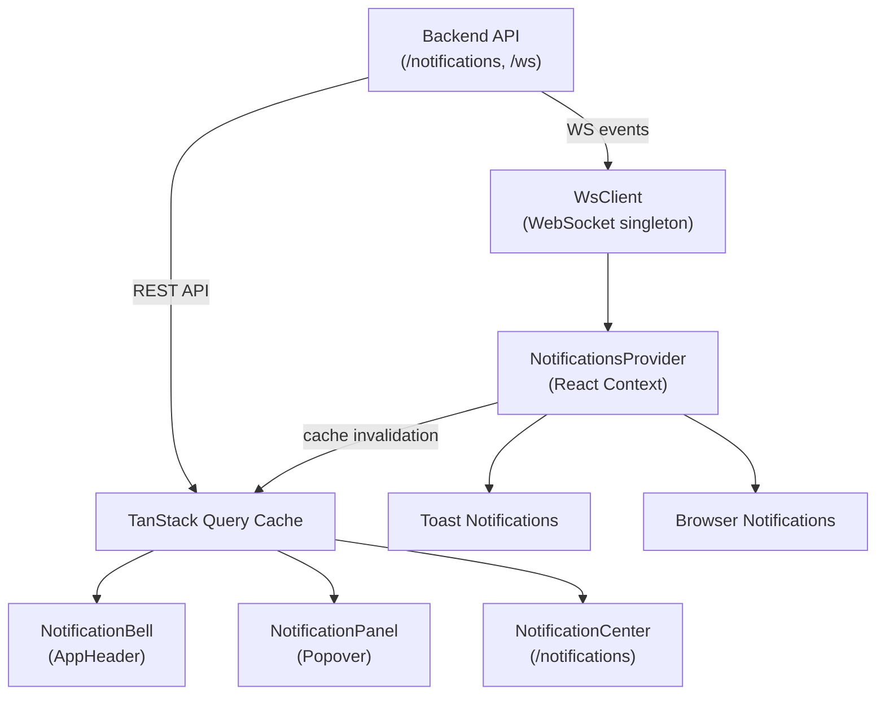
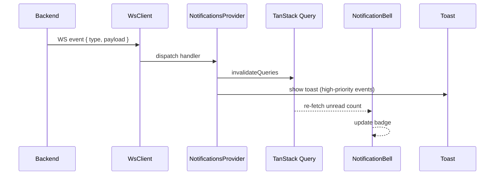

# Notification System

## Overview

SIMS Lite provides a complete real-time notification system that keeps users informed of inventory, procurement, and system events without requiring manual page refreshes.

---

## Architecture



---

## Notification Delivery Architecture



---

## Module Structure

```
src/features/notifications/
├── api/
│   └── notifications-api.ts      # REST API wrapper
├── components/
│   ├── notification-bell/        # Bell + badge + WS indicator
│   ├── notification-panel/       # Popover recent-list
│   ├── notification-list/        # Full paginated list
│   ├── notification-card/        # Single notification item
│   ├── notification-settings/    # User preferences form
│   └── compose-notification/    # Admin broadcast dialog
├── hooks/
│   └── use-notifications.ts      # TanStack Query hooks
├── pages/
│   └── NotificationCenterPage.tsx
├── schemas/
│   └── index.ts                  # Zod schemas
├── types/
│   └── index.ts                  # TypeScript types
├── utils/
│   └── browser-notifications.ts  # Browser Notification API utils
├── websocket/
│   ├── NotificationsProvider.tsx # WS context + event dispatch
│   └── use-ws-notifications.ts   # Status hook
└── index.ts                      # Public barrel export
```

---

## Notification Types

| Type | Icon | Use case |
|---|---|---|
| `info` | ℹ️ Blue | General information |
| `success` | ✅ Green | Completed actions |
| `warning` | ⚠️ Amber | Low stock, attention required |
| `error` | ❌ Red | Failures, rejections |

## Notification Categories

`inventory` · `procurement` · `stock_release` · `administration` · `system` · `general`

## Priority Levels

`low` · `normal` · `high` · `urgent`

---

## REST API Endpoints

| Method | Path | Description |
|---|---|---|
| `GET` | `/notifications` | Paginated list with filters |
| `GET` | `/notifications/unread-count` | Badge count |
| `PATCH` | `/notifications/:id/read` | Mark single as read |
| `PATCH` | `/notifications/:id/unread` | Mark single as unread |
| `PATCH` | `/notifications/read-all` | Mark all as read |
| `DELETE` | `/notifications/:id` | Delete notification |
| `POST` | `/notifications/compose` | Admin send broadcast |
| `GET` | `/notifications/preferences` | Fetch user preferences |
| `PATCH` | `/notifications/preferences` | Update preferences |

---

## TanStack Query Keys

```ts
notificationKeys.all              // ["notifications"]
notificationKeys.lists()          // ["notifications", "list"]
notificationKeys.list(params)     // ["notifications", "list", params]
notificationKeys.unreadCount()    // ["notifications", "unread-count"]
notificationKeys.preferences()    // ["notifications", "preferences"]
```

---

## Query Cache Synchronisation

When a WebSocket event arrives, the following caches are invalidated:

| WS Event | Invalidated Query Keys |
|---|---|
| `notification` | `["notifications"]` |
| `low_stock_alert` | `["inventory"]`, `["dashboard"]`, unreadCount |
| `stock_adjustment_completed` | `["inventory"]`, `["dashboard"]` |
| `stock_release_approved/rejected` | `["stock-release"]`, `["dashboard"]` |
| `purchase_order_*` | `["purchase-orders"]`, `["dashboard"]` |
| `grn_*` | `["grns"]`, `["dashboard"]` |
| `user_created`, `role_changed` | `["users"]` |

---

## Available Hooks

```ts
// Queries
useNotificationList(params?)        // Paginated list
useInfiniteNotifications(params?)   // Infinite-scroll list
useUnreadCount()                    // Badge count (polls every 60s)
useNotificationPreferences()        // User preferences

// Mutations
useMarkAsRead()                     // Single mark-as-read (optimistic)
useMarkAsUnread()                   // Single mark-as-unread (optimistic)
useMarkAllAsRead()                  // Mark all as read
useDeleteNotification()             // Delete with toast
useComposeNotification()            // Admin broadcast
useUpdateNotificationPreferences()  // Save preferences
```

---

## Browser Notifications

Requires Notification API permission (prompted on first enable in settings).

```ts
import { requestPermission, showBrowserNotification } from "@/features/notifications";

const permission = await requestPermission(); // "granted" | "denied" | "default" | "unsupported"

showBrowserNotification({
  id: "unique-id",            // deduplication key
  title: "Low Stock Alert",
  body: "Product X running low",
  forceShowWhenFocused: false // default: suppress when tab is active
});
```

The system automatically suppresses browser notifications when the browser tab is in focus to avoid double-alerting (toast is shown instead).

---

## Admin: Compose Notification

Only users with the `settings.edit` permission see the **Compose** button on the Notification Center page.

Fields:
- **Title** (3–120 chars)
- **Message** (5–1000 chars)
- **Type** — info / success / warning / error
- **Category** — inventory / procurement / stock_release / administration / system / general
- **Priority** — low / normal / high / urgent
- **Recipients** — All Users / By Role / Specific User ID
- **Action URL** (optional)
