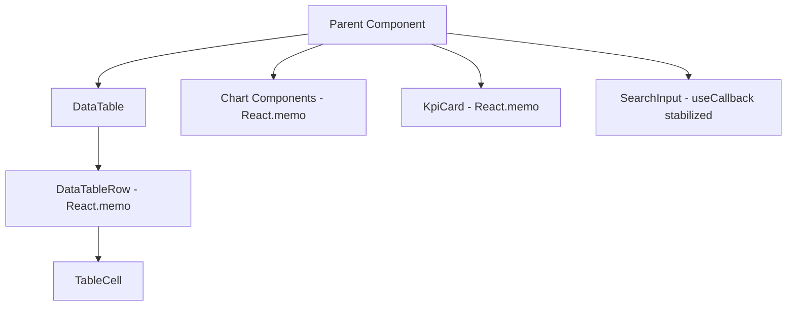
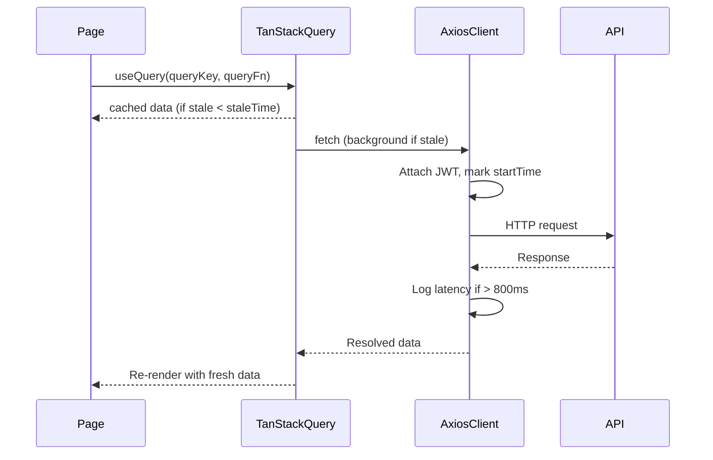

# Performance Optimization — SIMS Lite Frontend

**Phase 12** — Comprehensive runtime, bundle, and rendering optimization pass.

---

## Overview

This document summarizes all performance optimizations applied to the SIMS Lite Frontend during Phase 12. The application targets enterprise-scale deployment: hundreds of concurrent users, large datasets (thousands of rows), and high reliability.

---

## 1. Performance Audit Summary

| Area | Issue Found | Resolution |
|---|---|---|
| Bundle | No import optimization for heavy libs (`lucide-react`, `recharts`, `@radix-ui/*`) | `optimizePackageImports` in `next.config.ts` |
| Query Cache | Uniform 5-min staleTime for all data types | Tiered `QUERY_CACHE_TIMES` (Master Data: 15m, Dashboard: 5m, Live: 2m) |
| DataTable | Full table re-render on row selection | Memoized `DataTableRow` component |
| Chart Components | Re-renders on parent state changes | `React.memo` for all chart/KPI components |
| API Client | No response latency tracking | `logApiPerformance()` interceptor |
| WebSocket | Incomplete `onStatus` close, no bulk handler cleanup | Fixed + added `removeAllListeners()` |
| Search Input | New function references on every render | Stabilized with `useCallback` |
| Font | No explicit `preload` config | `preload: true` added to Inter font |
| Static Assets | No long-term cache headers | `Cache-Control: immutable` for `/_next/static/**` |

---

## 2. Rendering Architecture

---

## 3. Data Loading Lifecycle

---

## 4. Production Checklist

- [x] `optimizePackageImports` for all heavy libraries
- [x] Long-term cache headers for `/_next/static/**`
- [x] `compress: true` in Next.js config
- [x] `refetchOnMount: false` in global query defaults
- [x] Font `display: swap` + `preload: true`
- [x] Security headers for all routes
- [x] TypeScript strict mode, no ignored build errors

---

## 5. Remaining Trade-offs

| Trade-off | Decision |
|---|---|
| Route-level code splitting | Next.js App Router handles automatically per route segment |
| Virtual scrolling for large tables | Not yet — DataTable uses bounded `max-h-[70vh]` scroll. Consider `@tanstack/react-virtual` if datasets exceed 500 rows in a single page load |
| Optimistic updates on mutations | Not implemented — data integrity preferred over perceived speed for inventory mutations |
| Service Worker / PWA | Not enabled — enterprise deployment uses server-side auth tokens not compatible with SW cache |
