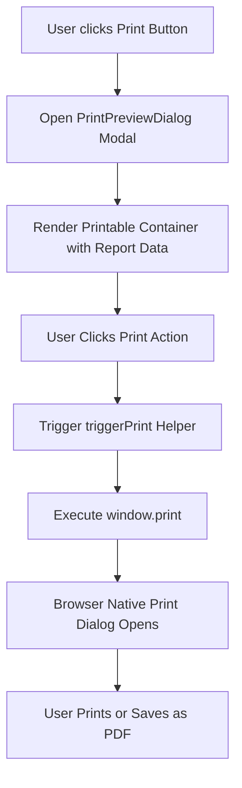

# Print Support Documentation

## Overview

The Print Support system allows users to generate clean, print-friendly report hardcopies directly from the web application using clean HTML structure and browser print dialogs.

## Print Features

- **Header Branding**: SIMS Lite Inventory Management company banner.
- **Timestamp & System Info**: Date, time, and system version timestamp.
- **Summary Section**: KPI cards presented as structured print blocks.
- **Clean Table Formatting**: Stripped interactive buttons, clean borders, high contrast for monochrome or color printing.
- **CSS `@media print` Isolation**: Hides navigation bars, sidebars, and dialog buttons when printing.

## Print Lifecycle Diagram

## Styling Specification

Print styles enforce:
- Hiding non-printable UI elements (`.print:hidden`)
- High contrast black-and-white table borders (`border-gray-200`)
- Page break protection on table rows (`page-break-inside: avoid`)
