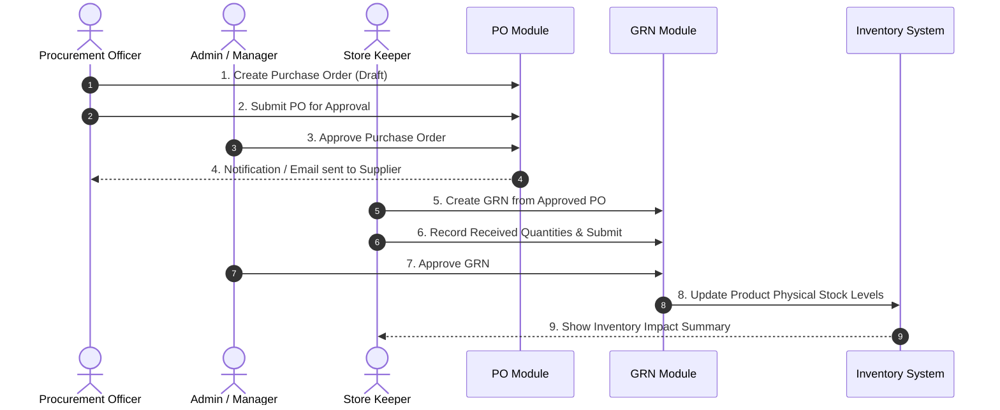

# End-to-End Procurement Workflow Documentation

## Overview
This document illustrates the end-to-end procurement process within SIMS Lite Frontend, tracing product requisition, purchase order issuance, supplier delivery, physical receipt via GRN, and automated inventory reconciliation.

## End-to-End Procurement Workflow

