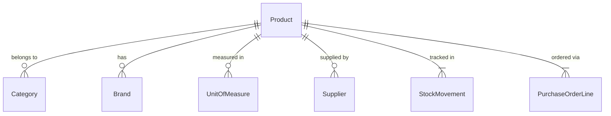

# Products

## Overview

The Products module is the central entity of SIMS Lite. Products track the items in your inventory system with full categorization, supplier, and stock management.

## Routes

| Route                  | Component              | Description              |
|------------------------|------------------------|--------------------------|
| `/products`            | `ProductsPage`         | Product list + CRUD      |
| `/products/:id`        | `ProductDetailPage`    | Product detail view      |

## Entity Structure

```typescript
interface Product {
  id: string;
  name: string;           // Required
  sku: string;            // Required, unique
  barcode?: string;       // Optional
  description?: string;   // Optional
  category_id?: string;   // FK → Category
  brand_id?: string;      // FK → Brand
  uom_id?: string;        // FK → UnitOfMeasure
  supplier_id?: string;   // FK → Supplier
  min_stock_level: number; // Default 0
  current_stock?: number; // From inventory (read-only)
  is_active: boolean;
  createdAt: string;
  updatedAt: string;
}
```

## API Endpoints

| Method   | Endpoint              | Description              |
|----------|-----------------------|--------------------------|
| `GET`    | `/products`           | List products            |
| `GET`    | `/products/:id`       | Get product by ID        |
| `POST`   | `/products`           | Create product           |
| `PATCH`  | `/products/:id`       | Update product           |
| `DELETE` | `/products/:id`       | Soft-delete product      |
| `POST`   | `/products/:id/restore` | Restore product        |

## Query Parameters

```typescript
interface ProductListParams {
  page?: number;
  page_size?: number;
  search?: string;         // Search by name or SKU
  is_active?: boolean;
  ordering?: string;       // e.g. "name", "-createdAt"
  category_id?: string;    // Filter by category
  brand_id?: string;       // Filter by brand
  supplier_id?: string;    // Filter by supplier
  uom_id?: string;         // Filter by UoM
}
```

## Features

### Products List Page

- Server-side search (name, SKU)
- Filter by Category, Brand, Supplier
- Active/Inactive toggle
- Sortable columns
- Server-side pagination
- Column visibility toggle
- Quick actions: View, Edit, Restore, Delete

### Product Detail Page

Sections displayed:
1. **General Information** — Name, SKU, Barcode, Description
2. **Classification** — Category, Brand, UoM, Supplier
3. **Inventory** — Current Stock, Minimum Stock Level, Low Stock alert
4. **Record Info** — Status, Created date, Updated date

### Product Form

Fields:
- Product Name (required)
- SKU (required, unique)
- Barcode (optional)
- Description (optional, textarea)
- Category (dropdown, loaded from API)
- Brand (dropdown, loaded from API)
- Unit of Measure (dropdown, loaded from API)
- Supplier (dropdown, loaded from API)
- Minimum Stock Level (number, ≥ 0)
- Active toggle

Validation:
- Name: 1–200 characters
- SKU: 1–100 characters
- Min stock: integer ≥ 0
- URLs: valid format if provided

## Hooks

```typescript
// Fetch products list
const { data, isLoading, error } = useProducts(params);

// Fetch single product
const { data: product } = useProduct(id);

// Mutations
const createProduct = useCreateProduct();
const updateProduct = useUpdateProduct(id);
const deleteProduct = useDeleteProduct();
const restoreProduct = useRestoreProduct();
```

## Low Stock Indicator

On the Products List page, the Stock column turns **red** when:
- `current_stock <= min_stock_level`

On the Product Detail page, a "Low Stock" badge is displayed in the same condition.

## Permissions

```typescript
"products.view"   // Read access
"products.create" // Create new products
"products.edit"   // Update + restore
"products.delete" // Soft delete
```

Role mapping:
- `ADMIN` / `SUPER_ADMIN` → all
- `OFFICER` → view only
- `STORE_KEEPER` → view only

## Data Relationships


