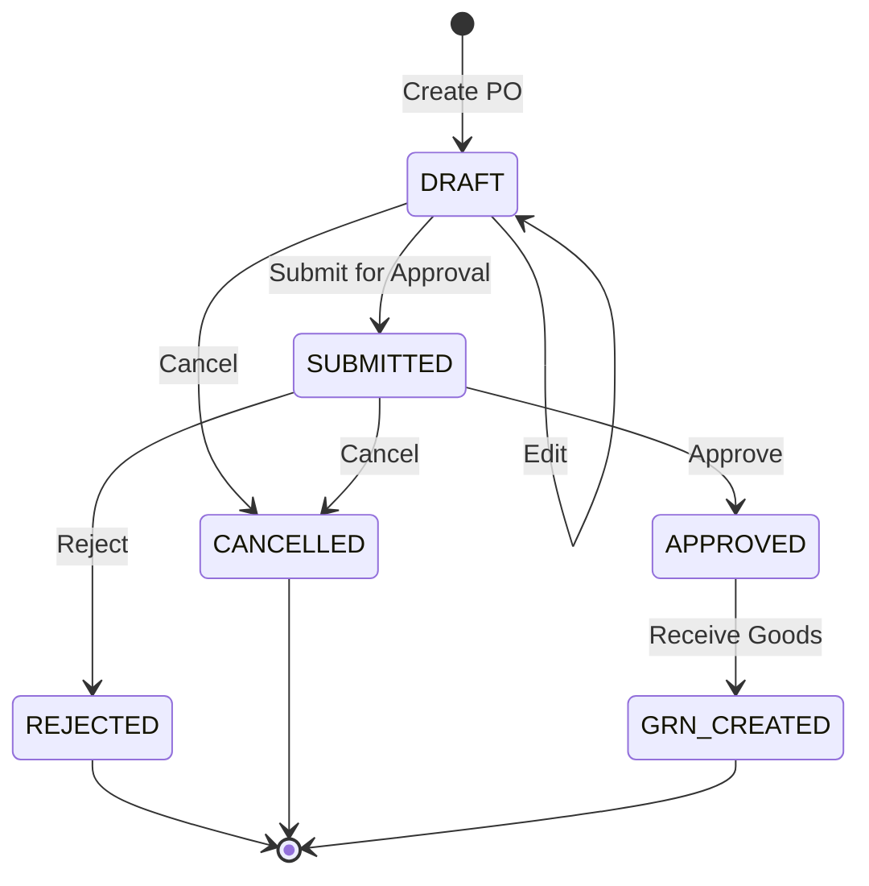

# Purchase Orders Module Documentation

## Overview
The Purchase Orders module manages the creation, approval, tracking, and cancellation of procurement orders sent to suppliers.

## Features
- **Purchase Order Listing**: Multi-field search, status filtering, supplier filtering, date range filtering, and pagination.
- **Dynamic PO Form**: Header information and dynamic product line items with auto-computed line totals and grand totals.
- **Role-Based Workflow**:
  - **DRAFT**: Created/Edited by Procurement Officer or Admin.
  - **SUBMITTED**: Submitted for management approval.
  - **APPROVED**: Approved by Admin (or Officer if backend allows). Enables GRN generation.
  - **REJECTED / CANCELLED**: Terminated states with optional audit logs and reason notes.
- **Email Notifications**: Display status badge for supplier email notifications (`SENT`, `PENDING`, `FAILED`) with one-click manual retry action.

## Purchase Order Lifecycle

