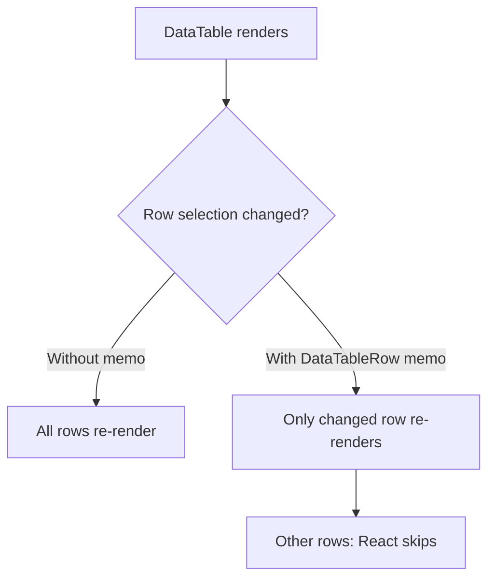
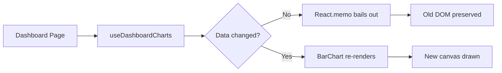
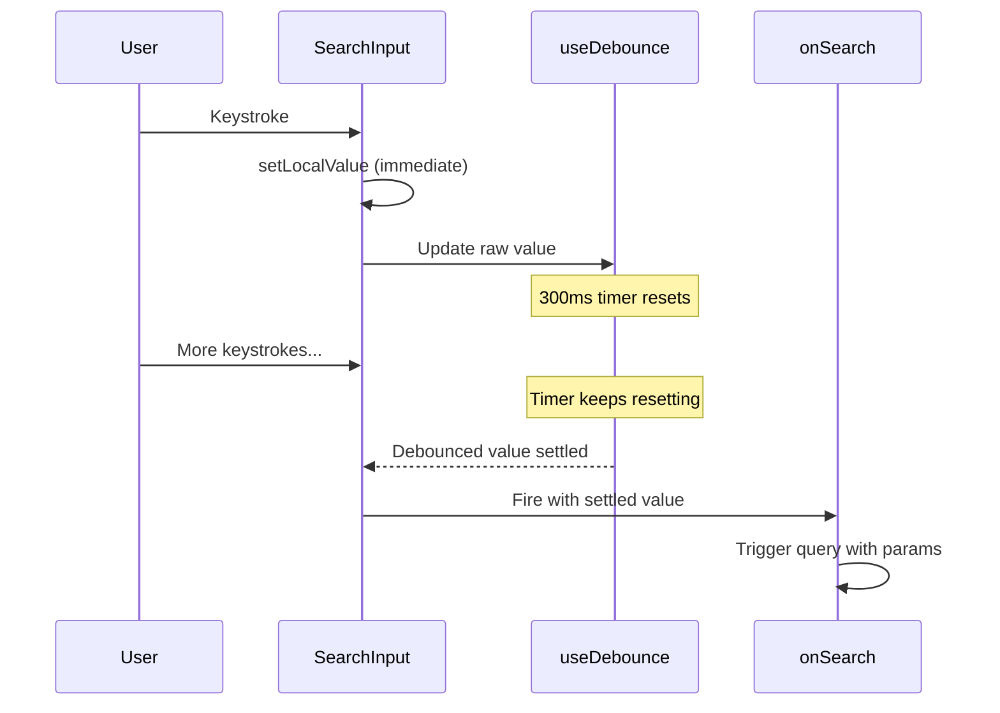

# Rendering Optimization — SIMS Lite Frontend

---

## 1. Memoization Strategy

### React.memo Usage

All expensive, pure presentational components are wrapped with `React.memo`. This prevents re-renders when parent components update state that is unrelated to the component's props.

| Component | File | Reason |
|---|---|---|
| `DataTableRow` | `components/common/data-table/index.tsx` | Prevents full-table re-render on row selection changes |
| `LineChart` | `app/components/charts/index.tsx` | Chart re-render is expensive; only re-render when `data` changes |
| `BarChart` | `app/components/charts/index.tsx` | Same as above |
| `AreaChart` | `app/components/charts/index.tsx` | Same as above |
| `PieChart` | `app/components/charts/index.tsx` | Same as above |
| `DonutChart` | `app/components/charts/index.tsx` | Same as above |
| `KpiCard` | `app/components/charts/index.tsx` | Pure display component; props rarely change |
| `ReportCharts` | `features/reports/components/charts/ReportCharts.tsx` | Heavy Recharts render; only updates on `data` or `reportType` change |

### useMemo Usage

| Component | Hook | Purpose |
|---|---|---|
| `DataTable` | `useMemo<ColumnDef[]>` | Prevents column definition recreating the `__select__` column every render |

### useCallback Usage

| Component | Hook | Purpose |
|---|---|---|
| `SearchInput` | `useCallback(handleChange)` | Stable function ref prevents child input re-renders |
| `SearchInput` | `useCallback(handleClear)` | Stable function ref for the clear button |

---

## 2. DataTable Row Isolation

**Before:** Every `rowSelection` state change caused all `N` rows to re-render.  
**After:** Only rows whose `row.getIsSelected()` result changed re-render.

For a table with 100 rows and frequent checkbox interactions, this eliminates up to 99% of unnecessary cell renders.

---

## 3. Chart Rendering Flow

---

## 4. Search Debouncing Flow

---

## 5. Anti-Patterns Avoided

| Anti-Pattern | Status |
|---|---|
| Inline arrow functions creating new refs every render | Fixed with `useCallback` in `SearchInput` |
| Anonymous component functions inside render | Fixed: `DataTableRow` defined outside `DataTable` body |
| New object literals in JSX props on every render | Column defs are in `useMemo` |
| `useState` inside render functions | N/A — not found |
| Large context causing full subtree re-renders | Auth context is minimal; UI context avoided |
