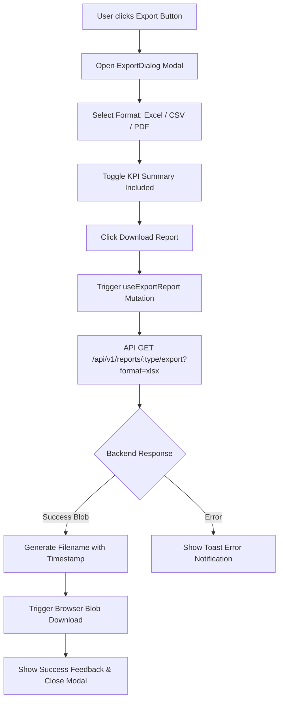

# Data Export Workflow Documentation

## Overview

The export system enables users to export filtered report datasets in **Excel (.xlsx)**, **CSV (.csv)**, and **PDF (.pdf)** formats directly from backend APIs using binary blob streaming.

## Supported Formats

- **Excel (.xlsx)**: Spreadsheet format containing headers, data formatting, and KPI summary rows.
- **CSV (.csv)**: Lightweight tabular text format for integration with data pipelines.
- **PDF (.pdf)**: Formatted document view for executive distribution.

## Export Workflow



## Binary Download Utility

The export utility uses `URL.createObjectURL(blob)` to create an in-memory download link, programmatically clicks the link element, and releases object URLs to prevent memory leaks:

```typescript
export function downloadBlob(blob: Blob, filename: string): void {
  const url = window.URL.createObjectURL(blob);
  const link = document.createElement("a");
  link.href = url;
  link.setAttribute("download", filename);
  document.body.appendChild(link);
  link.click();
  link.parentNode?.removeChild(link);
  window.URL.revokeObjectURL(url);
}
```
