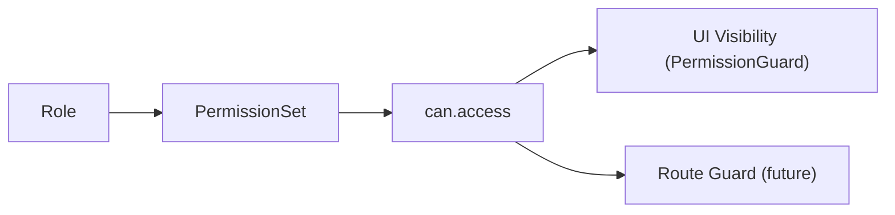

# Role Management

## Roles

SIMS Lite defines three primary operational roles, plus extended roles for compatibility with the backend.

| Role | Label | Use Case |
|---|---|---|
| `admin` / `super_admin` | Admin / Super Admin | Full system access |
| `procurement_officer` | Procurement Officer | Purchasing, suppliers, GRN |
| `stock_clerk` | Stock Clerk | Inventory, stock release |
| `warehouse_manager` | Warehouse Manager | All clerk + officer operations |
| `viewer` | Viewer | Read-only access |

## Role Hierarchy

```
super_admin (6) > admin (5) > warehouse_manager (4) >
procurement_officer (3) > stock_clerk (2) > viewer (1)
```

Defined in `src/lib/auth/index.ts` via `ROLE_HIERARCHY`.

## Permission System

Permissions use dot-notation: `domain.action`.



### Permission Domains

| Domain | Actions |
|---|---|
| `dashboard` | view |
| `users` | view, create, edit, delete |
| `products` | view, create, edit, delete |
| `categories` | view, create, edit, delete |
| `brands` | view, create, edit, delete |
| `suppliers` | view, create, edit, delete |
| `purchase_orders` | view, create, edit, approve, delete |
| `grn` | view, create, edit |
| `inventory` | view, adjust, transfer |
| `stock_release` | view, create, approve |
| `reports` | view, export |
| `settings` | view, edit |
| `notifications` | view |

### Role Authorization Flow

```mermaid
flowchart TD
    A[Component requests permission check] --> B[PermissionGuard / can()]
    B --> C[useAuthStore.role]
    C --> D[canAccess / canAccessAll / canAccessAny]
    D --> E{ROLE_PERMISSIONS map lookup}
    E -- Permission found --> F[Render content]
    E -- Permission missing --> G[Render fallback / null]
```

## Navigation per Role

### ADMIN / SUPER_ADMIN
Dashboard, Users, Products, Categories, Brands, Suppliers, Purchase Orders, GRN, Inventory, Stock Release, Notifications, Reports, Settings

### PROCUREMENT_OFFICER / WAREHOUSE_MANAGER
Dashboard, Products, Suppliers, Purchase Orders, GRN, Inventory, Stock Release, Notifications, Reports

### STOCK_CLERK
Dashboard, Inventory, Stock Release, Notifications

### VIEWER
Dashboard, Inventory, Reports, Notifications

## Adding a New Permission

1. Add the permission string to the `Permission` union type in `src/lib/auth/permissions.ts`
2. Add it to the appropriate role arrays in the same file
3. Use it in components via `<PermissionGuard permission="domain.action">` or `can("domain.action")`

## Checking Permissions Programmatically

```typescript
import { canAccess, canAccessAll, canAccessAny } from "@/lib/auth/permissions";

// Single
canAccess("admin", "products.create"); // true

// All required
canAccessAll("stock_clerk", ["inventory.view", "users.create"]); // false

// Any match
canAccessAny("stock_clerk", ["users.create", "inventory.view"]); // true (has inventory.view)
```

From a component (Zustand hook):

```typescript
const { can } = useAuthStore();
can("products.create"); // true/false based on current user's role
```
