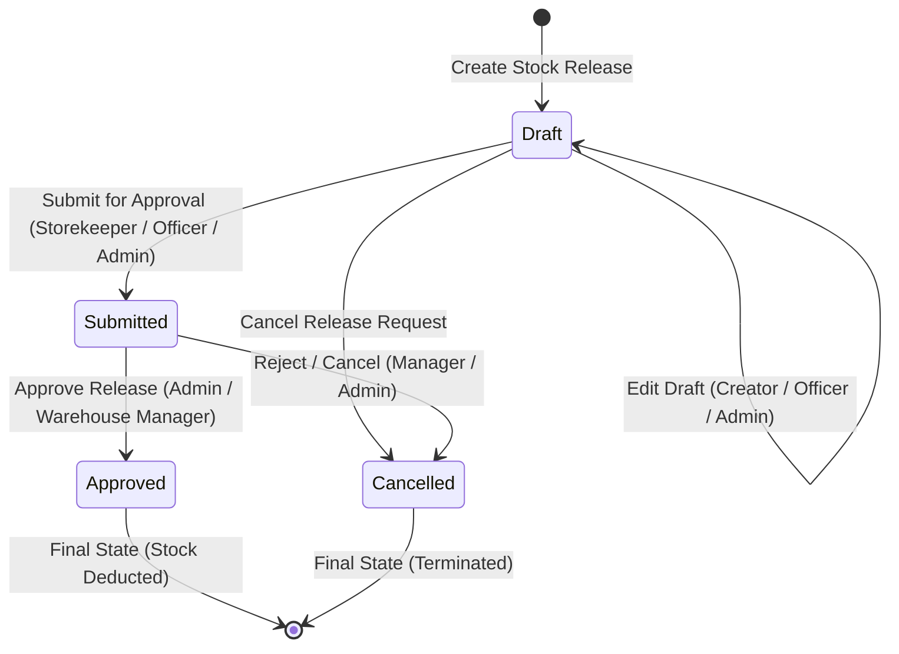
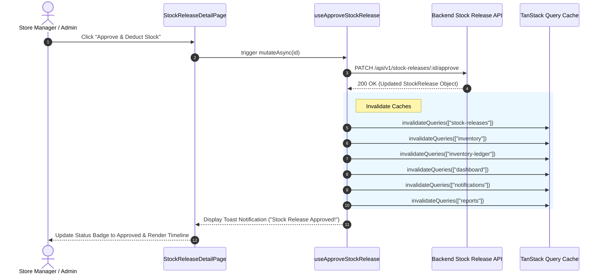
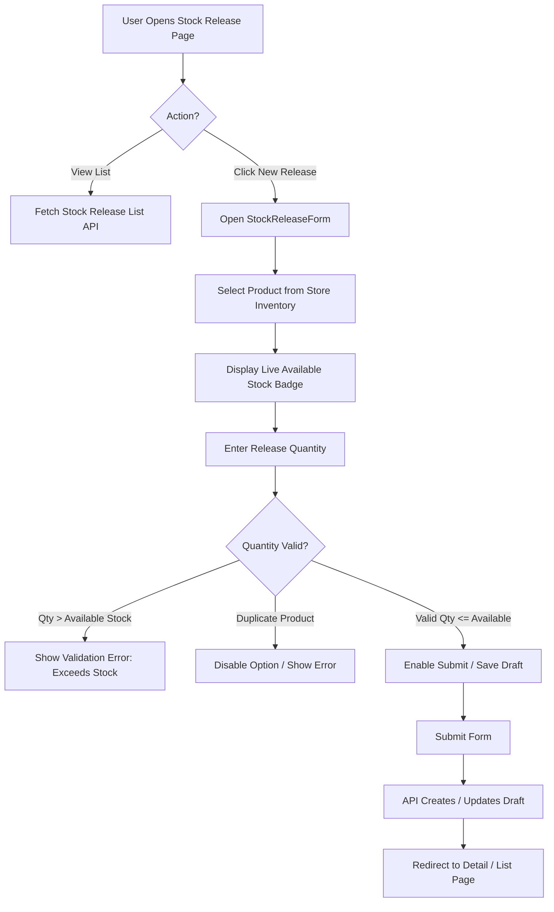

# Stock Release Workflow & Lifecycle Architecture

This document describes the state machine, inventory deduction flow, and user interaction model for the **Stock Release Management** module in SIMS Lite.

---

## 1. Stock Release Lifecycle State Machine

---

## 2. Inventory Deduction Flow

When a Manager approves a Stock Release (`PATCH /api/v1/stock-releases/:id/approve`), the system updates live stock levels and invalidates client-side caches.

---

## 3. User Interaction Flow

