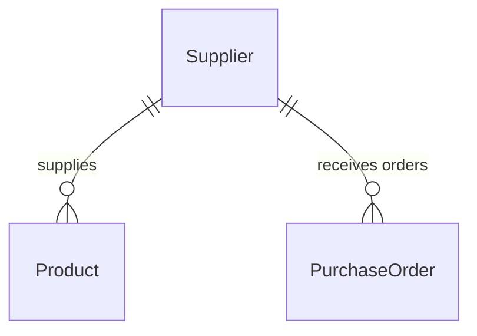

# Suppliers

## Overview

Suppliers represent companies or individuals that provide products to your organisation.

## Routes

| Route                  | Component              | Description               |
|------------------------|------------------------|---------------------------|
| `/suppliers`           | `SuppliersPage`        | Supplier list + CRUD      |
| `/suppliers/:id`       | `SupplierDetailPage`   | Supplier detail view      |

## Entity Structure

```typescript
interface Supplier {
  id: string;
  company_name: string;    // Required
  contact_person?: string; // Optional
  email?: string;          // Optional
  phone?: string;          // Optional
  address?: string;        // Optional
  city?: string;           // Optional
  country?: string;        // Optional
  notes?: string;          // Internal notes
  is_active: boolean;
  product_count?: number;  // Count of linked products
  createdAt: string;
  updatedAt: string;
}
```

## API Endpoints

| Method   | Endpoint                    | Description              |
|----------|-----------------------------|--------------------------|
| `GET`    | `/suppliers`                | List suppliers           |
| `GET`    | `/suppliers/:id`            | Get supplier             |
| `POST`   | `/suppliers`                | Create supplier          |
| `PATCH`  | `/suppliers/:id`            | Update supplier          |
| `DELETE` | `/suppliers/:id`            | Soft-delete              |
| `POST`   | `/suppliers/:id/restore`    | Restore                  |

## Features

### Suppliers List Page

- Server-side search (company name)
- Active/Inactive filtering
- Columns: Company, Contact Person, Contact Info (Email/Phone), Location, Status, Created
- Email and Phone as clickable `mailto:` / `tel:` links
- Quick actions: View Detail, Edit, Restore, Delete

### Supplier Detail Page

Sections:
1. **Company Information** — Company Name, Contact Person, Email, Phone
2. **Address** — Street Address, City, Country
3. **Notes** — Internal notes (visible only to staff)
4. **Products** — Product count (linked to inventory in future update)
5. **Record Info** — Status, Created, Updated

## Hooks

```typescript
const { data } = useSuppliers(params);
const { data: supplier } = useSupplier(id);
const createSupplier = useCreateSupplier();
const updateSupplier = useUpdateSupplier(id);
const deleteSupplier = useDeleteSupplier();
const restoreSupplier = useRestoreSupplier();
```

## Permissions

```typescript
"suppliers.view"   // Read access
"suppliers.create" // Create supplier
"suppliers.edit"   // Update + restore
"suppliers.delete" // Soft delete
```

Role mapping:
- `ADMIN` / `SUPER_ADMIN` → all
- `OFFICER` → view, create, edit
- `STORE_KEEPER` → none

## Data Relationships


