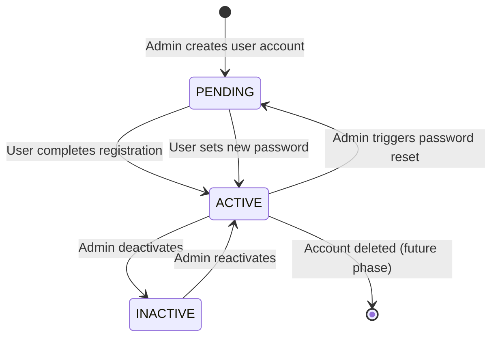
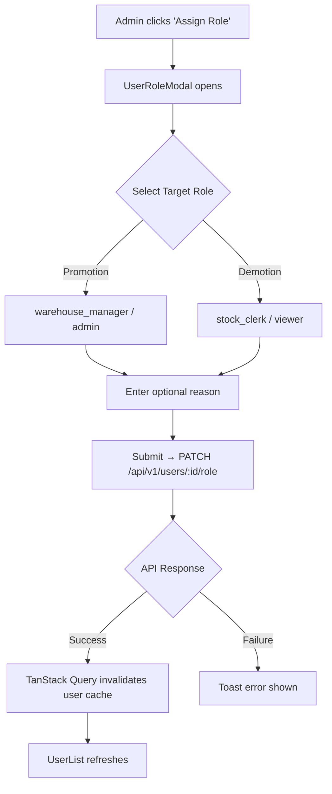

# User Management — SIMS Lite Phase 10

> [!NOTE]
> This document covers the complete User Management module for system administrators. Only `admin` and `super_admin` roles have full access to these capabilities.

## Overview

The User Management module provides administrators with a centralized workspace to:
- Create, view, edit, and manage all system users
- Assign and modify system roles
- Activate or deactivate user accounts
- Trigger password resets
- View user activity and notification history

---

## Module Location

```
src/features/admin/users/
├── api/          admin-users-api.ts
├── components/   UserList, UserFormDialog, UserDetailsModal, UserRoleModal, ResetPasswordModal, UserStatusToggle
├── hooks/        use-admin-users.ts
├── pages/        UsersPage.tsx
├── schemas/      user.schema.ts
├── types/        index.ts
└── utils/        user-helpers.ts
```

### Route
- **Primary**: `/admin/users`
- **Legacy Redirect**: `/users` → `/admin/users`

---

## User Lifecycle



---

## Role Assignment Flow



---

## API Endpoints

| Method | Endpoint | Action |
|--------|----------|--------|
| `GET` | `/api/v1/users` | List all users (with pagination & filters) |
| `GET` | `/api/v1/users/:id` | Get user details, activity, notifications |
| `POST` | `/api/v1/users` | Create new user account |
| `PUT` | `/api/v1/users/:id` | Update user fields |
| `PATCH` | `/api/v1/users/:id/status` | Toggle active/inactive status |
| `POST` | `/api/v1/users/:id/reset-password` | Trigger password reset |
| `PATCH` | `/api/v1/users/:id/role` | Assign a new role |

---

## Query Hooks

```typescript
// List users with filters
const { data, isLoading } = useUsersList({ search: "jane", role: "admin", page: 1 });

// Get single user detail (for modal)
const { data: userDetail } = useUserDetail(userId);

// Mutations
const { mutate: createUser } = useCreateUser();
const { mutate: updateUser } = useUpdateUser();
const { mutate: toggleStatus } = useToggleUserStatus();
const { mutate: resetPassword } = useResetUserPassword();
const { mutate: assignRole } = useAssignUserRole();
```

---

## Supported User Filters

| Filter | Values |
|--------|--------|
| `search` | Text (name, email, department) |
| `role` | `ALL`, `super_admin`, `admin`, `warehouse_manager`, `procurement_officer`, `stock_clerk`, `viewer` |
| `status` | `ALL`, `ACTIVE`, `INACTIVE`, `PENDING` |
| `page` | Page number (default: 1) |
| `limit` | Items per page (default: 10) |

---

## Permissions Matrix

| Action | super_admin | admin | warehouse_manager | procurement_officer | stock_clerk | viewer |
|--------|:-----------:|:-----:|:-----------------:|:-------------------:|:-----------:|:------:|
| View Users | ✅ | ✅ | ❌ | ❌ | ❌ | ❌ |
| Create User | ✅ | ✅ | ❌ | ❌ | ❌ | ❌ |
| Edit User | ✅ | ✅ | ❌ | ❌ | ❌ | ❌ |
| Assign Role | ✅ | ✅ | ❌ | ❌ | ❌ | ❌ |
| Activate/Deactivate | ✅ | ✅ | ❌ | ❌ | ❌ | ❌ |
| Reset Password | ✅ | ✅ | ❌ | ❌ | ❌ | ❌ |

---

## Components Reference

| Component | Props | Description |
|-----------|-------|-------------|
| `UserList` | `users`, `filters`, `onFilterChange`, etc. | Main data table with search and filtering |
| `UserFormDialog` | `isOpen`, `user`, `onSubmitCreate`, `onSubmitUpdate` | Create / Edit modal |
| `UserDetailsModal` | `user`, `isOpen`, `onClose` | Tabbed profile view (General, Activity, Notifications) |
| `UserRoleModal` | `user`, `isOpen`, `onAssignRole` | Role selector with reason field |
| `ResetPasswordModal` | `user`, `isOpen`, `onResetPassword` | Auto-generate or manual password reset |
| `UserStatusToggle` | `user`, `isOpen`, `onConfirm` | Confirmation dialog for status change |
