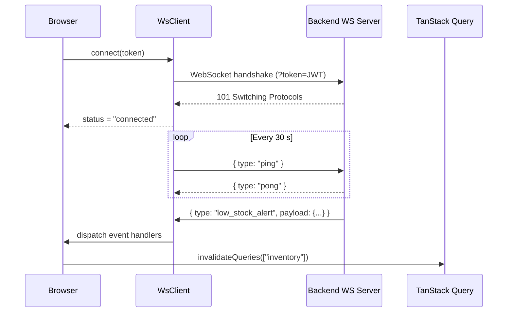
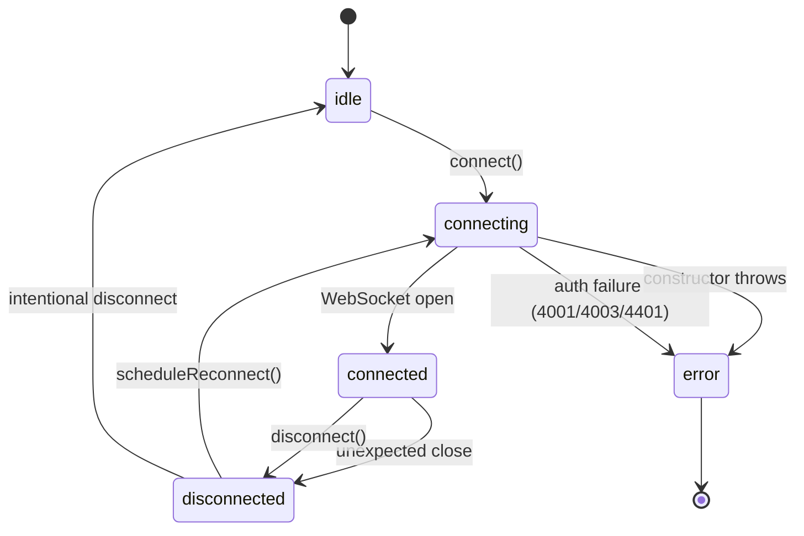

# WebSocket Integration

## Overview

SIMS Lite uses a persistent WebSocket connection to deliver real-time events from the backend to the browser without polling. The connection is managed by a singleton `WsClient` class defined in `src/lib/websocket/ws-client.ts`.

---

## Architecture



---

## Connection Lifecycle



---

## Authentication

The client appends the current JWT access token as a query parameter on every connection (including reconnects):

```
ws://api.example.com/ws/notifications?token=<access_token>
```

`configureWsClient({ getToken })` wires in the token getter after the auth module initialises. This is called once from `SessionProvider`.

If the server closes the connection with code `4001`, `4003`, or `4401`, reconnection is **not** attempted — the user must re-authenticate.

---

## Reconnect Strategy

| Attempt | Delay     |
|---------|-----------|
| 1       | ~1 s      |
| 2       | ~1.5 s    |
| 3       | ~2.25 s   |
| 4       | ~3.4 s    |
| 5       | ~5 s      |
| …       | …         |
| Max     | 30 s cap  |

Maximum 10 attempts. After that, `status` becomes `"error"`.

---

## Event Subscription

```ts
import { getWsClient } from "@/lib/websocket/ws-client";

const ws = getWsClient();

// Subscribe to a specific event type
const unsub = ws.on("low_stock_alert", (payload) => {
  console.log("Low stock:", payload);
});

// Subscribe to ALL events
const unsubAll = ws.on("*", (event) => {
  console.log("WS event:", event);
});

// Clean up
unsub();
unsubAll();
```

---

## Connection Status

```ts
const unsub = ws.onStatus((status) => {
  // "idle" | "connecting" | "connected" | "disconnected" | "error"
  console.log("WS status:", status);
});
```

In components, use the `useWsNotifications()` hook:

```ts
const { status, isConnected } = useWsNotifications();
```

---

## Environment Variables

| Variable | Default | Description |
|---|---|---|
| `NEXT_PUBLIC_WS_URL` | `ws://localhost:8000/ws/notifications` | WebSocket endpoint |

---

## Supported Event Types

| Type | Trigger |
|---|---|
| `notification` | Generic notification created |
| `low_stock_alert` | Product drops below reorder level |
| `stock_adjustment_completed` | Stock adjustment approved |
| `stock_release_approved` | Stock release request approved |
| `stock_release_rejected` | Stock release request rejected |
| `purchase_order_submitted` | PO submitted for approval |
| `purchase_order_approved` | PO approved |
| `purchase_order_rejected` | PO rejected |
| `grn_submitted` | GRN submitted |
| `grn_approved` | GRN verified |
| `user_created` | New user registered |
| `role_changed` | User role updated |
| `settings_updated` | System settings changed |
| `broadcast` | Admin-sent broadcast message |
| `maintenance` | System maintenance notice |
